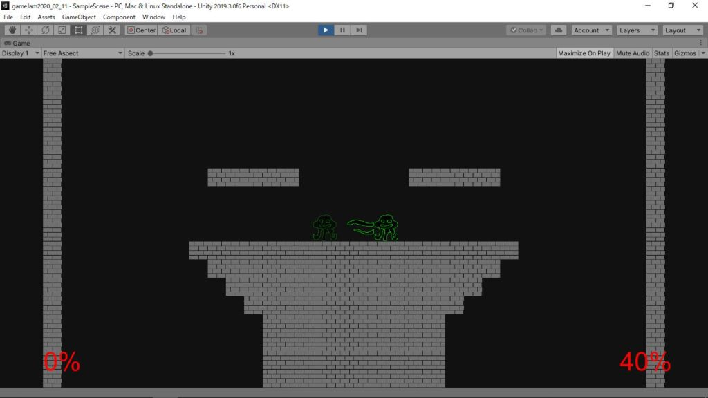
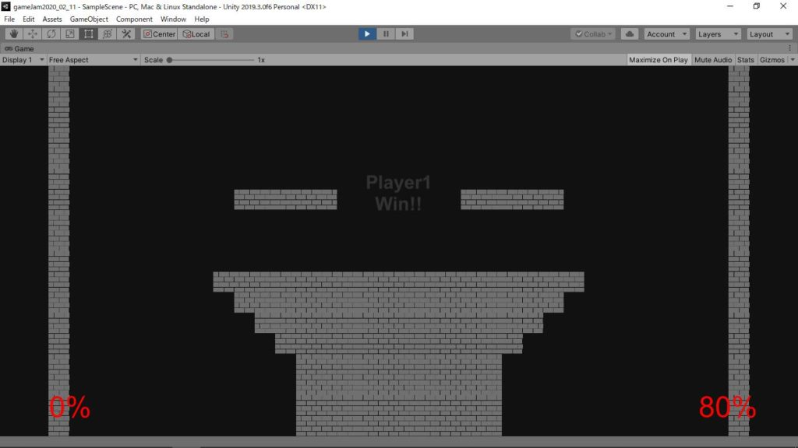
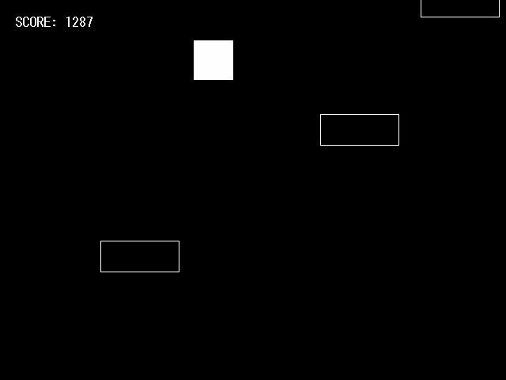
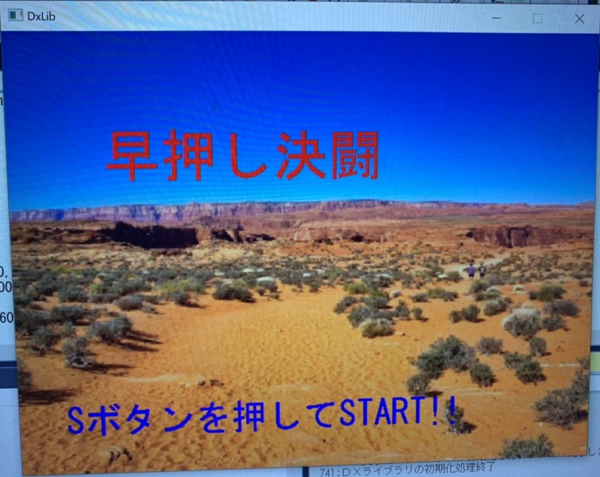
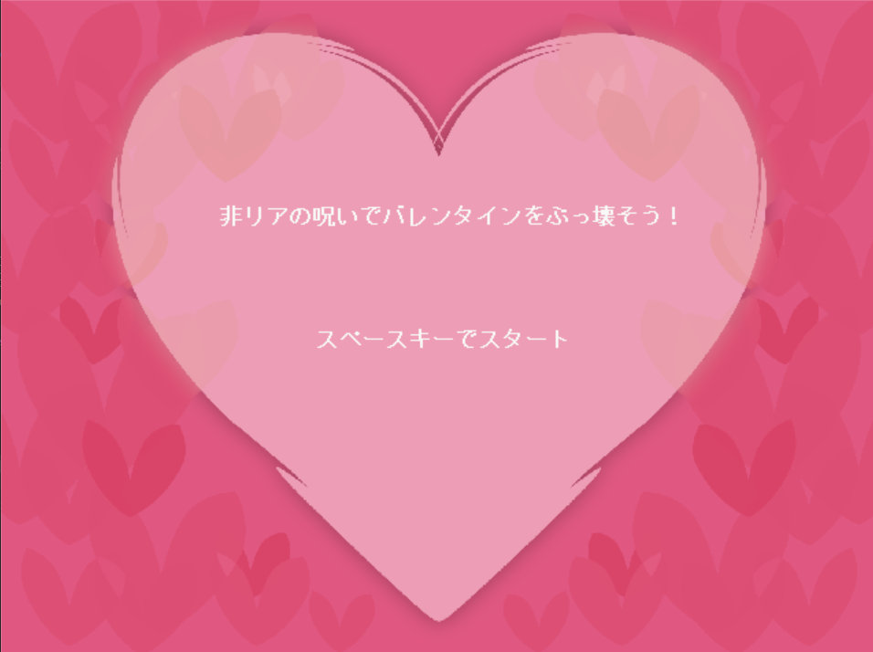
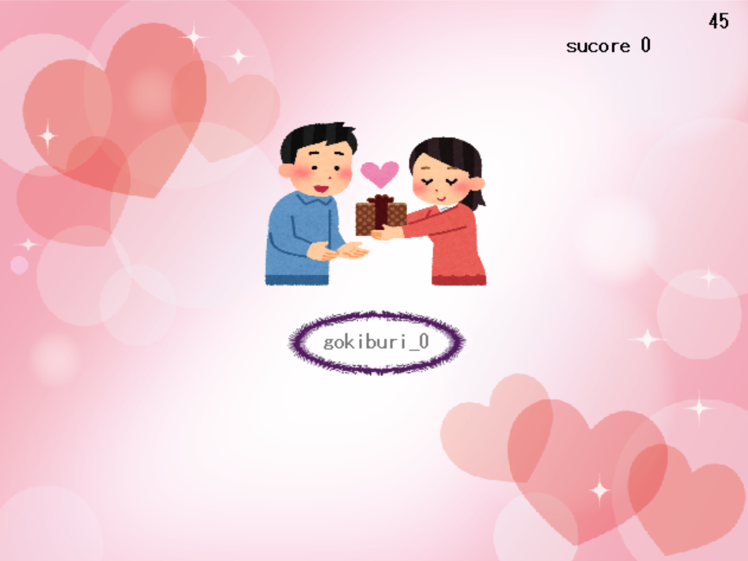
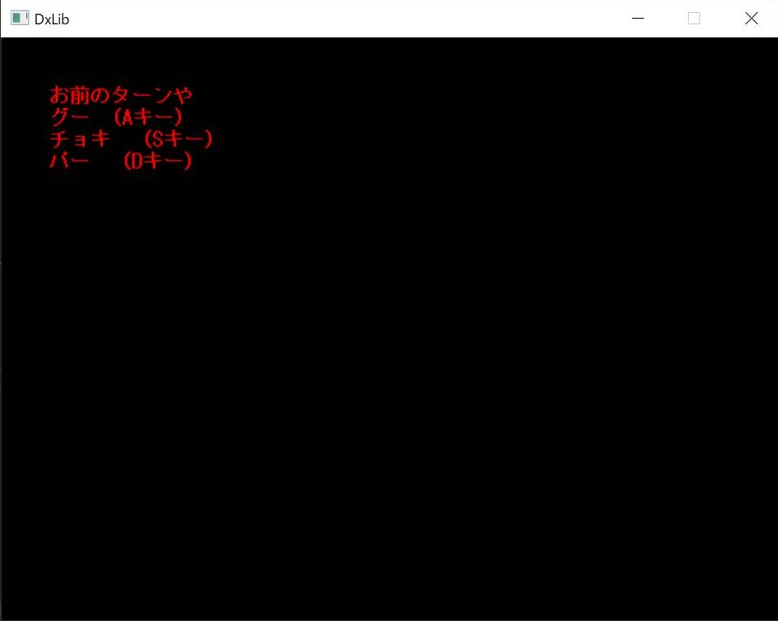
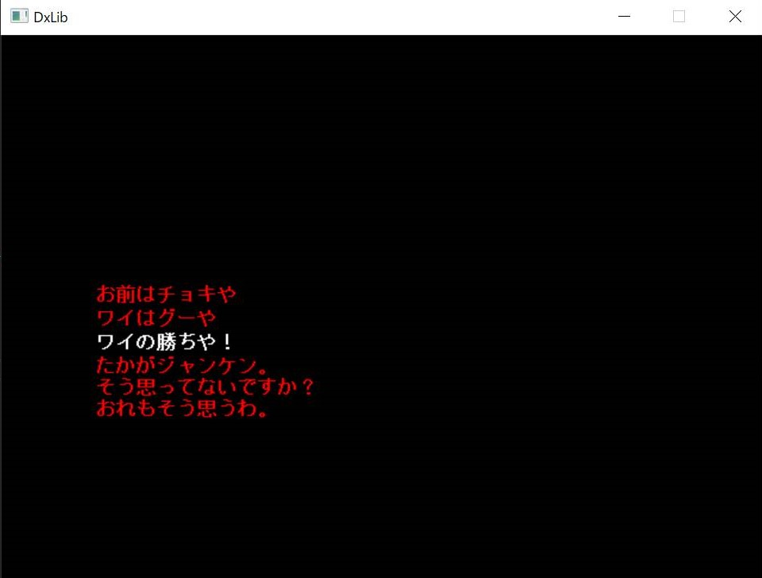
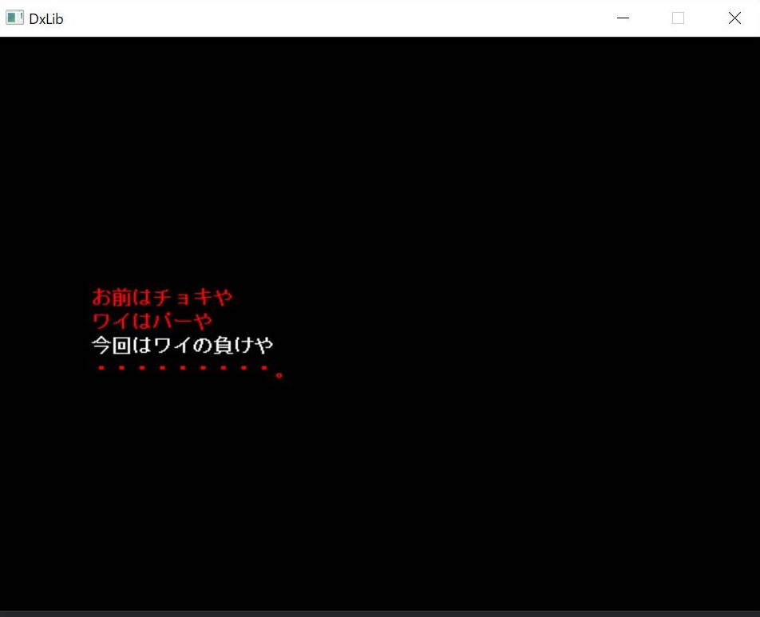

　こんにちは、2年次のまんじゅうです。今回は2月11日(火)にゲームジャムを行いました。今回はいつもの個人作業では無く、ゲーム制作が苦手な人が主となって制作し、詰まったらペアの得意な人に助けて貰いつつ制作していく、ペアプログラミング形式(厳密には違う気がしますが)で行いました。

　今回のお題は「階段」、「決闘」、「超常現象」、の3つと、時期的に丁度良かったので「チョコレート」を含め、計4つに設定しました。

　下に各参加者の成果物を紹介していくので、是非ご覧下さい。

## 成果物紹介

1年　なりょー　(補助　ズッキー(2年))

制作環境　Unity

　「決闘」を使った対戦ゲームで、一言で言うと「スマブラ」とのことです。相手に攻撃すると20％のダメージが溜まり、一定のダメージが溜まるとスマブラの様に場外に吹っ飛ばせます。見ていて爽快感があるゲームだと感じました。

<figure>

<figcaption>

右側の生物が伸ばしている触手みたいな奴が攻撃です

</figcaption>

</figure>

<figure>

<figcaption>

勝利判定もしっかり出ます

</figcaption>

</figure>

1年　ハイブリッジ　(補助　まんじゅう(2年)、いっちー(3年))

制作環境　DXライブラリ

　「階段」を使ったアクションゲームで、次々に出てくる床に飛び乗っていくゲームです。ゲーム自体はどんどん生成される床にひたすら乗り続けると単純なものですが、強制スクロールをさせたり、画面の左右をループさせたりとシステム面でいろいろな工夫を凝らしているのが印象的でした。

<figure>

<figcaption>

常時ジャンプしていることもあり、意外と難しいんです

</figcaption>

</figure>

2年　クマ　(補助　まんじゅう(2年))

制作環境　DXライブラリ

　「決闘」を使った作品で、一言で言うとカービィの「刹那の見切り」ですね。3ラウンドあり、ラウンドごとに入力猶予時間(敵の強さ)が厳しくなっていきます。早押しが始まるタイミングを乱数でずらしているようなので、結構再現度が高く仕上がっていると感じました。

<figure>

<figcaption>

直撮りで申し訳ないとの事でした。勝敗画面はかなり面白かったです(ここでは色々まずいので割愛)

</figcaption>

</figure>

2年　こうぐち　(補助　いっちー(3年))

制作環境　DXライブラリ

　「超常現象」を使ったタイピングゲームで、タイピングによる不思議な力でリア充を不幸にするゲームのようです。ゲーム自体は普通のタイピングゲームですが、ゲームの設定が凝っていたり、タイピングが成功した際の加点がやたら高得点だったりと印象に残る所が多い作品でした。

<figure>

<figcaption>

開催したときはホットな話題でした。投稿遅くて申し訳ない

</figcaption>

</figure>

<figure>

<figcaption>

タイピングに成功するとここから1億点(確か)増えます

</figcaption>

</figure>

4年　HIM

補助　まんじゅう(2年)

制作環境　DXライブラリ

　4年次ですが、「慣れていないDXライブラリで何か作ってみたい」ということでこちらの枠で紹介します。「決闘」を使ったゲームで、簡単に言うと「本田のじゃんけん」ですね。ただ元ネタの関係で、勝率3分の1の普通のじゃんけんでは無く、相手の勝率が7割程になっているそうです。勝敗を決め、それから相手の手を決定するようにしているということで、上手く再現できていたように感じました。

<figure>

<figcaption>

手の選択は緊張します

</figcaption>

</figure>

<figure>

<figcaption>

相手が勝ったら煽ってきます。3通りあるそうです

</figcaption>

</figure>

<figure>

<figcaption>

こちらが勝った版も。こちらも3通りあるとのこと

</figcaption>

</figure>

## 最後に

　今回は普段と違う形式でしたが、教えて貰う側はもちろん、教える側も教える立場ならではの発見もあったりしたので、両者が学べる良い会になったと思います。

　ただ、今回意図せず「決闘」という非常に簡単にゲームの方向性が決まるお題を入れてしまったためにそれを選んだ参加者同士が似たような作品になりやすい環境にしてしまいました(今回は完全な被りはなんとか回避しましたが)。そのため、今回の反省を活かして次回以降の開催ではもう少し慎重にお題を決めたいと思います。

　また、実は今回ちゃんと意図があってゲームジャムの形式を変えていました。というのも、あと1ヶ月程で新入生が入ってくる(はず)ので、この会でノウハウを学んで春休みや今後の制作活動の糧にして、今のうちに制作活動に対する抵抗や苦手意識をある程度和らげてもらいたいと考えたからです。結果としては計8人と普段より参加者が多く、またゲームジャム初参加の人もいたため、悪くは無かったように思います。欲言えばもうちょい1年来て欲しかった

　ここだけ現役部員向けの話になりますが、春休みもまだ1ヶ月残っているので、今のうちに夏コミの作品を作っておく事をオススメします。今年は5月の連休に開催で、4月が忙しくなりがちなので、春休みが終わってしまうとほとんど時間がありませんし。皆で頑張っていきましょう。

　長くなりましたが、最後まで見て下さってありがとうございました。
