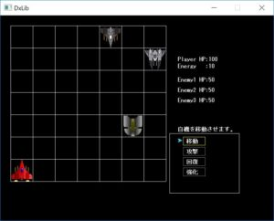
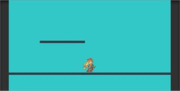
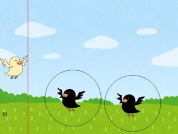
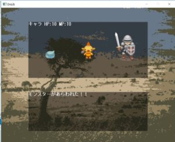
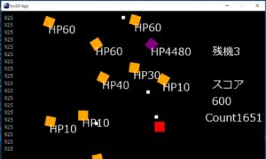
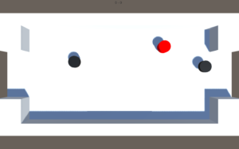

皆さんどうもこんにちは！Web担当のでったーでございます。本日は11月の月末報告会として部員同士でゲーム製作やその他担当箇所の進捗を確かめ合いました。(皆さん忙しかったみたくて進捗は厳しい状況・・・)

ここからはゲームとしてある程度形になっている作品をご紹介していきます！

* * *

製作者:まんじゅう(初年次)

製作物:RPG

* * *

製作者:でんそん(初年次)

製作物:2Dゲーム

* * *

製作者:たか(初年次)

製作物:2Dシューティング

* * *

製作者:いっちー(2年次)

製作物:RPG

* * *

製作者:Yuta(2年次)

製作物:2Dシューティング

 

* * *

製作者:GoldenRiver(3年次)

製作物:ホッケーゲーム

* * *

この他にも様々なゲーム案が報告されコミケに向けていい作品を提供するべく現在頑張っておりますので応援よろしくおねがいします！
