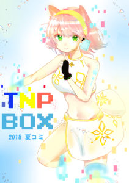

# [特設サイトはこちら←](https://akita-tnp-comic.tumblr.com/)

* * *

## 2018コミケ夏！来る！

こんばんえるえる〜〜〜〜。 TNPのWeb担当ガナリヤです！(ガナリヤはWeb言語が言うて得意ではない。誰か変わって･･･)

今日は2018夏コミックマーケットの、TNPの出品作品を見ていこうと思います！ 特設サイトは上記のリンクにありますので是非！

　

### 表紙

まずはこちらの表紙ですね！ 二年次の蟹さんの作品です！

かわいい！！！！！ これまでのTNP子ちゃんよりも、デジタルでVTuberっぽい作風となっています。 これはもうジャケ買いする人がでてくることでしょう･･･(中身でも勝負しろ(迫真))

今回のTNPBOXのTNP子ちゃんがVTuberっぽい作風になったのは訳があります。現在二年次のうおちーさんが、TNP念願のTNP子VTuber化を図って躍進してくれています。TNP子のVTuberデビューも近い･･･？ そして、そのVTuberを意識して蟹さんにイラストを書いていただきました！ これまでのTNP子になかった猫耳属性や、スカート姿など、新たな新生TNP子が垣間見えた気がします！

表紙が可愛いのは認める。ただ、表紙だけほしいっていう声はゆるさない！

　

### UniPyon

ゲーム紹介に入っていこうと思います。 まずはこちらの作品「UniPyon」。製作者は我らが部長こしょうです。

こちらのゲームでは、Unityちゃんを操作してウニティを中央のゴールにゴールするといったゲームです！ 僕と同じくコミケ終盤で一気に詰め込んだゲームながら、クオリティは素晴らしく、とくにグラフィック面はもうただただすごいことになってます(動画でみせたい)！ 音楽に合わせてウニティや波形が動いたり、発光を上手に使っているなど、とても楽しい雰囲気になっています！

ただ、僕が一番好きなのはこの部分。

タイトル画面がわかりやすい！そして、タイトルで遊べる！！！これ大事な要素です！ タイトルで遊べるゲームは神ゲー。はっきりわかんだね。

非常に素晴らしい作品になっています。 是非ご試遊ください！

　　

### JumpingBox

次はこちらの作品「JumpingBox」。 製作者は、二年次うおちーです。(二年次のほうが三年次より作品を多く作っている･･･うっ頭が･･･)

ゲームライブラリはSiv3D! うおちーもSiv3Dの便利さに気づいてしまったようです。 ゲーム内容としては、自動生成される足場を踏んでいきながら、落ちないようにできる限り上に登り続けていくというゲームです。 こういうシンプルなゲームはつい、やり続けてしまうという魔性の力があります･･･(3敗) 来年は、老害ながら、二年次がものすごく優秀なので何も心配がないです。(老害ムーブ(三年次もがんばるぞ))

　　　

### UFOキャッチャー

続いてはこちらの作品「UFOキャッチャー」。 製作者は、二年次yutaくんです(強すぎぃ！)。

こちらのゲームはUnityでできており、3Dゲームでの参戦です。 ゲーム内容は、アームでグッズをふんっ！ってやる、そうUFOキャッチャーそのものです！ Unityでこういった物理演算をやるのは非常に難しく、スクリプトもだいぶ増えてしまうため大変なのですが、素晴らしい出来になっています。 モードも複数用意されており、練習モードで鍛え上げてから本戦モードに望むことができます。

そして、一番僕が好きだったのが、発表の際の物理演算バグです。 やっぱり、3Dゲームは時たまにバグってしまうのが最高なんだなと勉強になりました。 僕も制作活動頑張ろうと思います。(2年次にも1年次にも負けられない！)

　

### Just Do It!

続いてはこちらのアプリ？「JustDoIt」 製作者は、ガナリヤ(僕)です。

JustDoItにはまり、パソコンのスリープを解除したときに自動でJustDoItおじさんの声が流れると勉強頑張れるんじゃないか？と思って作りました。

ライブラリはElectronを使用しており、解説はhttps://qiita.com/ganariya/items/6c9ca69ca1c89282c228に書いてます。こちらのページからダウンロードもできます。

TNPはゲームだけと思われがちですが、イラスト・音楽、そしてアプリ制作もあるんだぞ！ というところも見せていきたいです。

* * *

　　　　　　　　 　　　　

以上が今回の作品となり･･･

･･･あの作品を忘れているじゃないか！ 　　　

### TNG

自分がMacでTNGを起動できなかったため画像はお見せできないのが悲しいのですが･･･ こちらのTNGは、三年次のサバとこしょうの共同制作になっています。

こちらの作品TNGは「TNP　Generator」　の略であり、ゲームでなく、アプリとなっています。 使用ライブラリはUnityであり、TNPの作品をデータベースに登録し、検索をすると自動で起動してくれるという代物です！ ソースコードは五万行を超えているとかなんとか･･･（すごい(絶句)） 今回の配布はTNGも入っているらしく、サバとこしょうの一年間の集大成が詰まっています。特に、サバはほぼ毎日こちらの作品に力を注いでおり、一時期はSiv3Dで実装していましたが、ライブラリの関係上、一度すべてUnityに移し、更に開発を進めていました！(すごい(悶絶)) 　  
今回のTNP\_BOXの中で、一番やばい作品だと思います！ 是非！明日のコミックマーケットで触っていただければと思います！やばいです！！！！！！！！

　

## まとめ

以上が、今回の夏コミのTNPBOXのお品書きになります！ 非常に濃厚な中身になっており、特に二年次の躍進、そして、サバ・こしょうの血の結晶が垣間見えたTNPBOXになっていると思います。

是非明日はTNPBOXを手にとっていただければと思います。

明日　8月10日西地区よ-24aにて、TNPBOXとともにお待ちしています！！！！！！
