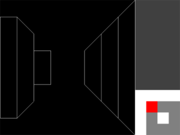
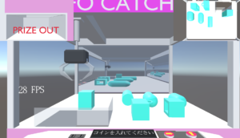
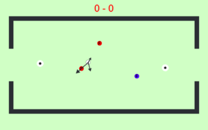
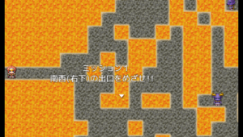
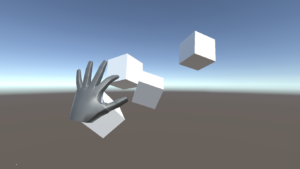

BLAZBLUE\_CROSS\_TAG\_BATTLEを過って購入した3年次Bヒロです。

　先日は『TNP5月の月末報告会』を開催しました。

\_\_\_\_\_\_\_\_\_\_\_\_\_\_\_\_\_\_\_\_\_\_\_\_\_\_\_\_\_\_\_\_\_\_\_\_\_\_\_\_\_\_\_\_\_\_\_\_\_\_\_\_\_\_\_\_\_\_\_\_\_\_\_\_\_\_\_\_\_\_\_\_\_\_

　制作者：いっちー(2年次)

　迷路などで使えそうなフィールドグラフィックを制作していただきました。右下には

マップ画面を表示しています。

　今後はさらに遠近感をだしたいとのこと。

\_\_\_\_\_\_\_\_\_\_\_\_\_\_\_\_\_\_\_\_\_\_\_\_\_\_\_\_\_\_\_\_\_\_\_\_\_\_\_\_\_\_\_\_\_\_\_\_\_\_\_\_\_\_\_\_\_\_\_\_\_\_\_\_\_\_\_\_\_\_\_\_\_\_

　制作者：YUTA(2年次)

　UFOキャッチャーゲームを制作してくれているようで、画面奥にはミラー、

右上には天井視点、左上は景品出口といったところでしょうか。

　見やすいグラフィックで完成が楽しみな作品です。

\_\_\_\_\_\_\_\_\_\_\_\_\_\_\_\_\_\_\_\_\_\_\_\_\_\_\_\_\_\_\_\_\_\_\_\_\_\_\_\_\_\_\_\_\_\_\_\_\_\_\_\_\_\_\_\_\_\_\_\_\_\_\_\_\_\_\_\_\_\_\_\_\_\_

制作者：Golden\_River(副会長)

　『スタイリッシュ・シミュレーション・アクション・エアホッケーゲーム』

　現在制作途中だそうで、夏コミまでには完成させたいとのこと。

\_\_\_\_\_\_\_\_\_\_\_\_\_\_\_\_\_\_\_\_\_\_\_\_\_\_\_\_\_\_\_\_\_\_\_\_\_\_\_\_\_\_\_\_\_\_\_\_\_\_\_\_\_\_\_\_\_\_\_\_\_\_\_\_\_\_\_\_\_\_\_\_\_\_

制作者：Bヒロ(3年次)

　『未定』

　敵キャラを避けて、右下を目指すためだけのゲームを今回は作成しました。

　ゲームバランスなどの、調整後RPGアツマールに投降予定

\_\_\_\_\_\_\_\_\_\_\_\_\_\_\_\_\_\_\_\_\_\_\_\_\_\_\_\_\_\_\_\_\_\_\_\_\_\_\_\_\_\_\_\_\_\_\_\_\_\_\_\_\_\_\_\_\_\_\_\_\_\_\_\_\_\_\_\_\_\_\_\_\_\_

　発表者：こしょう(会長)

　UnityでLeap Motionを見せていただきました。

　カメラにより、手を認識して、手先から立方体などを出したりなど、興味深いものを紹介

していただきました。

\_\_\_\_\_\_\_\_\_\_\_\_\_\_\_\_\_\_\_\_\_\_\_\_\_\_\_\_\_\_\_\_\_\_\_\_\_\_\_\_\_\_\_\_\_\_\_\_\_\_\_\_\_\_\_\_\_\_\_\_\_\_\_\_\_\_\_\_\_\_\_\_\_\_

　その他にも、TNP子Vtuber企画(うおちー(2年次)：TNP子のモデリング)、BGM制作、

イラスト制作などなどの発表もありとてもMARVELOUSでした。

　今月は初年次講義が始まったりとTNP新体制として動き出した月でした。

　6月には新入生歓迎会などイベントを開催予定です。
