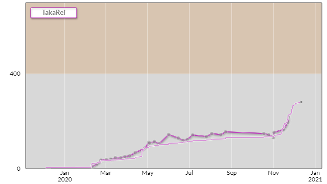
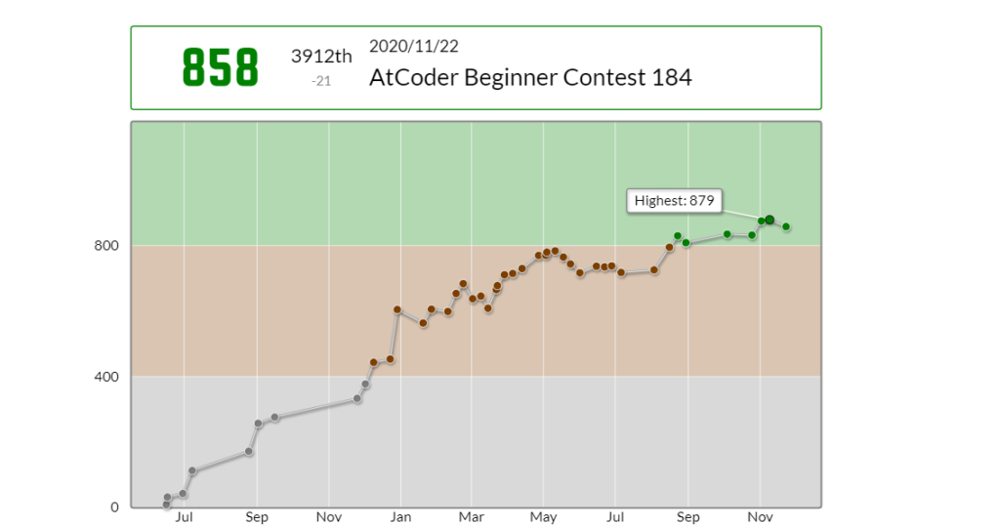

# はじめに

　こんにちは。2年次のハイブリッジです。10月に引き継ぎがあり、代替わりしました。よろしくお願いします。

　10月から感染症対策をしっかり行いながら部室で活動していました。月末報告会の記事を書かなきゃなぁ、と思いながらここまで来てしまいました。申し訳ない気持ちになりながらこの記事を書いていますがぼくはげんきです。

　というわけで、10月、11月分の月末報告会の内容を書いていきたいと思います。報告会から時間が経っているため覚えているもののみ書きます。ご了承ください。最後までお付き合いいただければ嬉しいです。

# 成果一覧

## 2年次

### ハイブリッジ

#### 10月

　スライドパズルを作りました。今回は3×3のパネルで作りました。15パズルに派生など、いろいろ考えています。画像はネットで拾ったものを試しに使ったので、ここに載せられないです。すみません。

#### 11月

　AtCoderをしていました。問題はABCのC問を頑張って解いてました。めざせD問！(^^;

### Naria

#### 10月

　pythonでグラフを作ってました。

　活動はしているのですが、形には残ってないです。

## 3年次

### まんじゅう

#### 10月

　東方のツクールゲームの進捗をお話ししていました。競技プログラミングの布教も......?

#### 11月

　RPGツクールで東方の続きを制作してました。

　AtCoderをやっていました。

# 最後に

　今回は遅くなったため、覚えているもののみとなりましたが、いかがだったでしょうか。一年次には競技プログラミングを布教するなどしたので、ゲーム制作のみならず、競技プログラミングの報告でもしてくれると嬉しいです。

　年末にちょっとした休みがあるので、年始後の報告会が楽しみですね。

　それでは今回はここまでです。お読みいただきありがとうございました。次回の月末報告会の記事は早めに書こうと思います。また次回にお会いしましょう。
