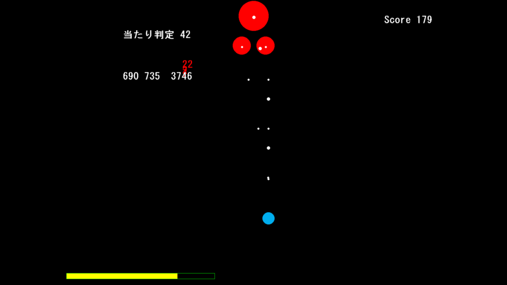
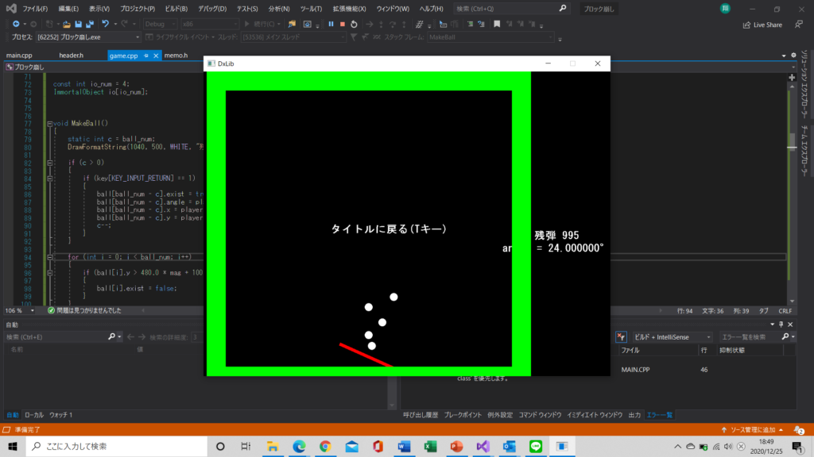
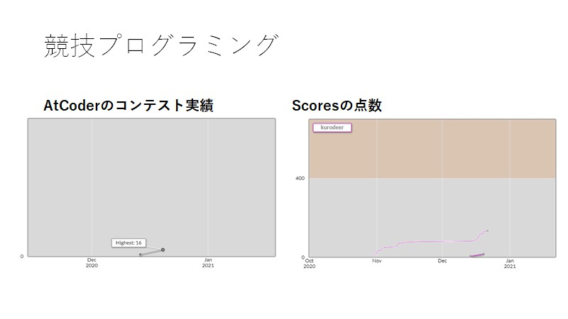
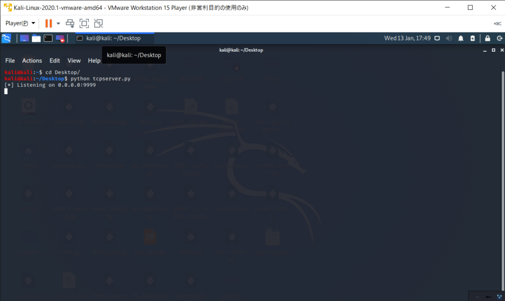
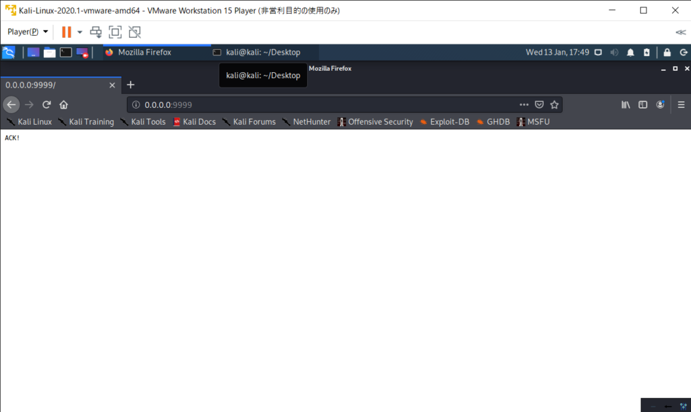
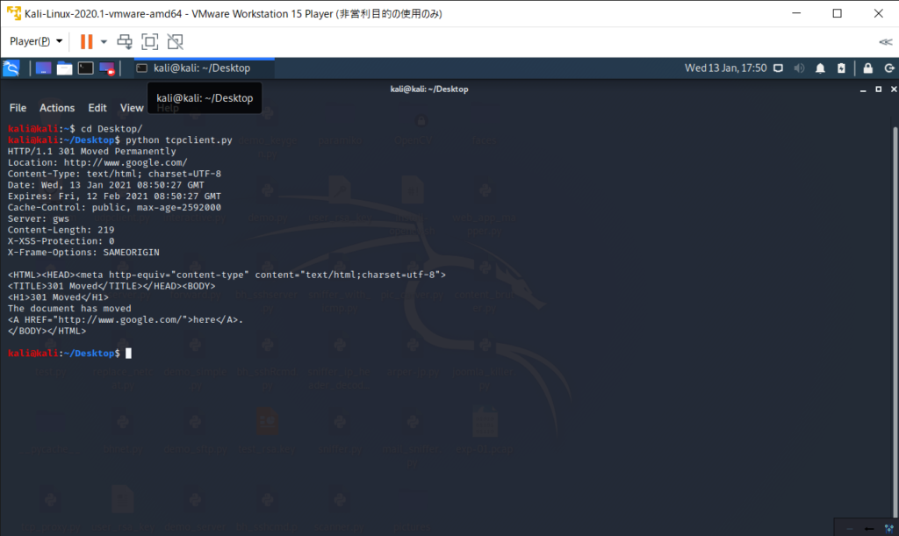
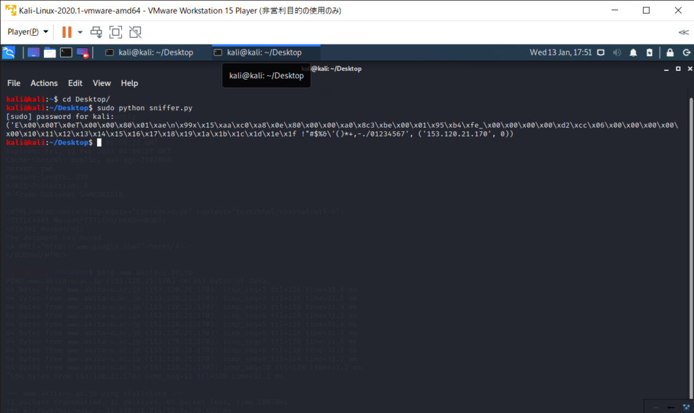
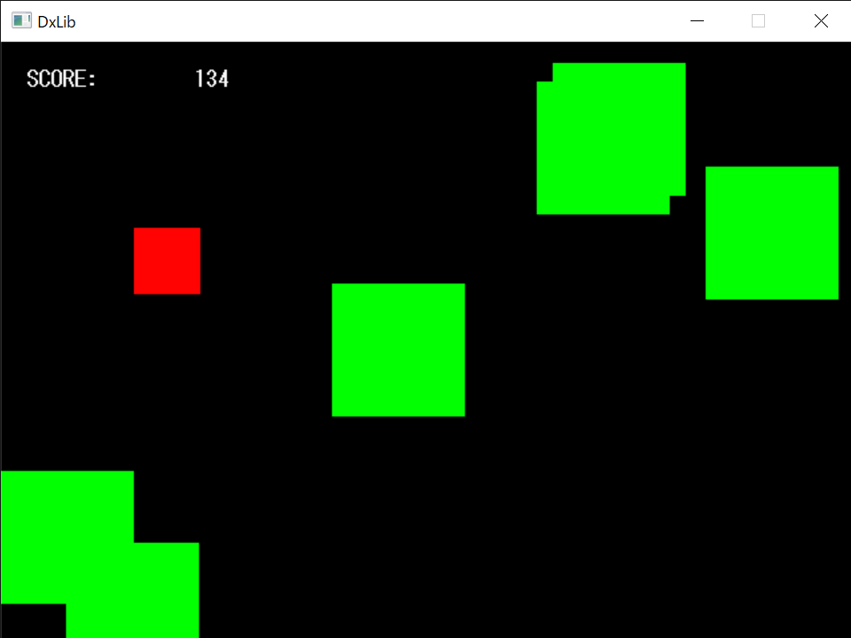
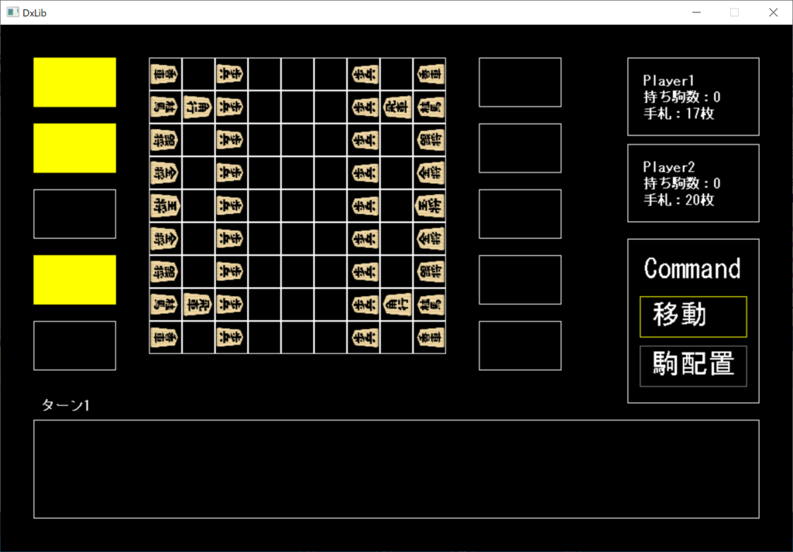

　こんにちは。新年あけましておめでとうございます。2年次のハイブリッジです。いまさらですが12月分の月末報告会について報告しようと思います。

# 1年次

## クロ

　シューティングゲームです。赤い丸が敵で徐々に下方向へ迫ってきます。青い時機に向かって弾を撃ってきますが、その弾が追尾弾である程度移動しないと当たってしまいます。左下のバーがエネルギー残量で、自機はこれを消費して弾を撃ちます。バーがなくなるまでどれだけスコアを上げられるか競いたくなりますね。

　ブロック崩しです。まだ壁に当たると反射するところまでですが、冬休みで完成させたいと言っていました。下の赤いバーで球を反射させるのですが、角度調節ができるようになっているため、通常のブロック崩しより優しいシステムになっていると思います。バーの当たり判定を丸をつなげて実装するという発想も面白いと思いました。これを書いている時点で冬休みは終わっているので、次の月末報告会が楽しみですね。

　クロ君のAtCoderの現状です。AtCoderは回数を重ねないと正確なレートは出てこないので、これからが楽しみですね。

# 2年次

## ハイブリッジ

　CTFの勉強をしていました。その一環としてTCPサーバを立てたり、TCPクライアントとして要求したり、自分で発信したパケットを自分で受け取ったりしてました。

<figure>

<figcaption>

　これでサーバを立てて、0.0.0.0:9999にウェブブラウザでアクセスすると真っ白なサイトにつながります。

</figcaption>

</figure>

<figure>

<figcaption>

　こんな感じにですね。

</figcaption>

</figure>

　ここではグーグルにつながるように要求してますね。

<figure>

<figcaption>

　こんな感じでパケットを受け取ってました。

</figcaption>

</figure>

　そろそろゲーム作らないとな、と思ってます。頑張ります。

## UMA

 いわゆる避けゲーですね。赤い正方形を操作して緑の敵に当たらないように避けまくるゲームです。生存した時間によってスコアが上がっていきます。難易度が6段階ぐらいあって、画像の難易度は一番上の難易度です。始めるごとにランダムで初期移動方向が決まった後、壁を反射して自機を追い詰めてきます。昔のPCやDVDプレーヤーでよく見る反射するアレから着想を得たそうです。なかなか難しかったです。シンプルながら面白いゲームでした。

# 3年次

## まんじゅう

　いつぞやの将棋がパワーアップして帰ってきた！知る人ぞ知る将☆〇☆王をゲームにしてくれました。公開する気はないのでおなじみのBGMなどやりたい放題でした。手札を見てみると懐かしのカードや効果が書かれていてワクワクする将棋だったぜ！

　ほかにもいろいろ頑張ってました。

# 最後に

　予断を許さない状況ですが、Discordなどで活動できるのは不幸中の幸いだと思います。みんな頑張っていて、俺も頑張らないと。と思いました。会長なのにあんまりゲーム作れてない感が出ているので、そろそろ作ります。

　ここまで見ていただき、ありがとうございました。次回の月末報告会でお会いしましょう。
