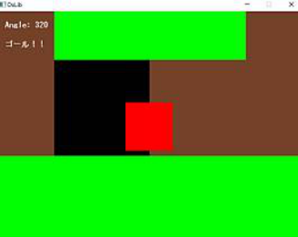
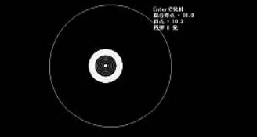
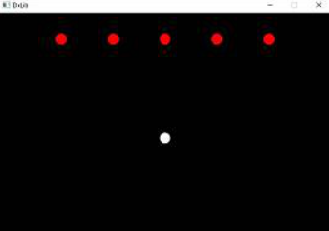

　2年次のハイブリッジです。タイトル通りゲームジャムを行いました。今回は1年次のまだゲームを作ったことがない人を対象に、ゲーム制作に慣れてもらうために企画しました。そのため、比較的ゲーム制作に慣れている2、3、4年次と1年次でペアを作り、一緒にゲームを制作するペアプログラミング方式で行いました。

　お題は「冬」「ウイルス」「車」「当てる」でした。開発環境は皆さんDXライブラリです。参加者の皆さんがどんなゲームを作るのか楽しみですね。

# ゴンシ(1年次)＆いっちー(4年次)

　赤い車を矢印キーで操作して3周するとゴールのレーシングゲームです。道、芝生、スタート＆ゴールの部分が色分けされており、芝生の部分に入ると速度が落ちるというリアリティのあるゲームとなっています。操作方法も凝っていて、ハンドル、アクセルなどの操作を忠実に再現していました。

　道なりに進まなくともラップ判定が行われるそうで、プレイヤーの品性が問われる（と思う）などの改善点もあるそうですが、しっかりとゲームが作られていて良いと思いました。

# クロ(1年次)

　マウスまたは十字キーで大きいほうの円を動かし、ランダムで設置される的を撃ちぬくシューティングゲームです。外縁から中心に近づくほど0.1点ずつ得点が上昇します。銃声の効果音がついていたり、弾に制限があったりと、こりゃまたよくできたゲームですよね。マウス操作が実装されていて、FPSの練習に持って来いないいゲームだと思います。反省点として、スコアのセーブを実装したかったそうで、勉強するとのことでした。

# ドラ(1年次)＆ハイブリッジ(2年次)

　十字キーで白い自機を操作し、赤い敵をスペースキーで出すショットで倒すシューティングゲームです。自分のショットが画面範囲外に行かないようにしたり、自分のショットの速さを上げたりと、様々な試行錯誤を頑張っていました。これだけできれば色々つけ足すだけでさらに発展したゲーム内容にできそうだと思うので、期待が高まる作品だと思いました。初参加でしっかりと形になったゲームでいいと思います。

# Amp.(1年次)

　テーマは「ウイルス」「当てる」で、スペースキーで緑の円(薬)を発射し、赤い三角(ウイルス)を消滅させます。スペースキーを長く押すほど薬の初速度が増加し、ウイルスに当たるか薬の速度が0になると爆発、周囲のウイルスが消滅します。また、爆発は連鎖します。これにより、爽快感を得られるようにしたそうです。画像がないのは私(ハイブリッジ)の落ち度です。申し訳ありません。製作者談では、「初のゲームジャムでしたが、限られた時間で納得するクオリティに落とし込むことができました。」とのことです。その言葉通り高いクオリティの物となっていました。流石です。

# あとがき

　皆さん素晴らしいゲームでしたね。忙しい中参加していただいた皆さんには本当に感謝しています。ありがとうございました。

　今回のゲームジャムを通して、ゲーム制作の流れをつかんでもらえたと思います。今は書いているプログラムが分からなくても、継続は力なり、プログラミングを続けていれば必ず分かるようになります。なのでこれで終わらず、これからも頑張ってほしいですね。最後までお読みいただきありがとうございました。
