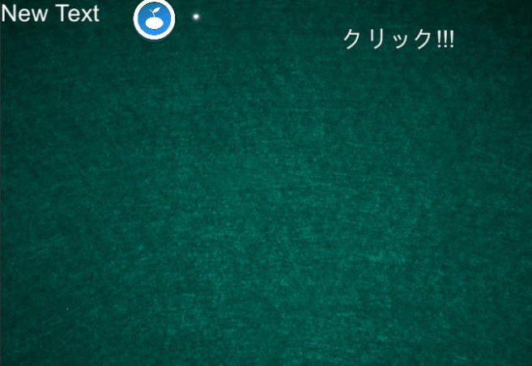
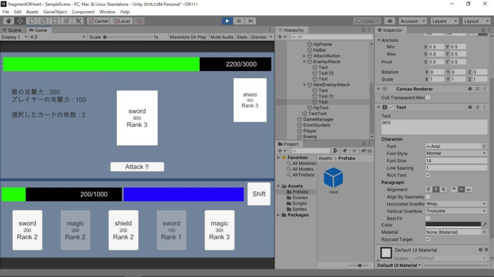
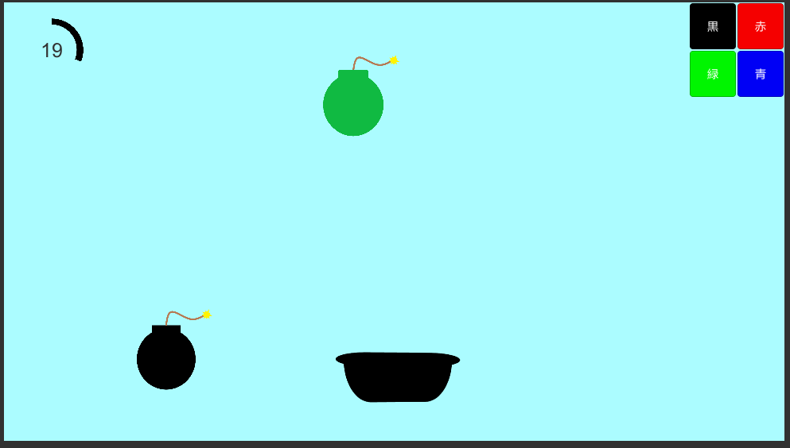
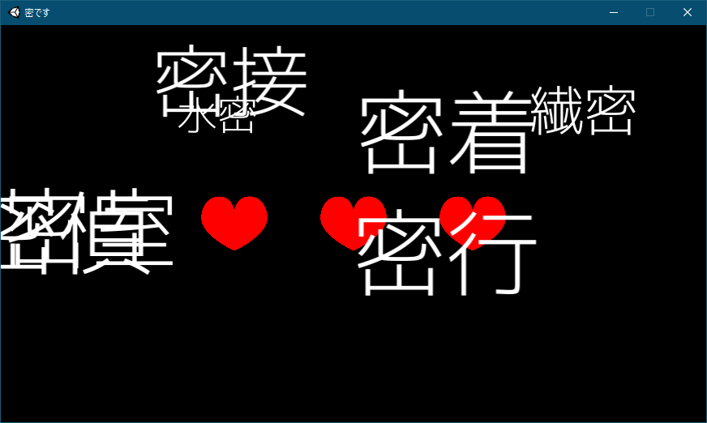
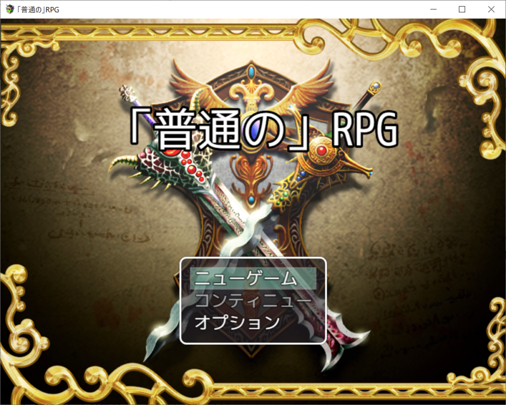

## はじめに

　こんにちは。3年次のまんじゅうです。今もまだ大変な状況が続いていますが、なんとか皆で生きていきましょう。

　今回は、毎月末に行っている報告会での各々の成果を紹介したいと思います。現在部室での活動が禁止されているため、初のオンラインでの報告会となりました。

　今は直接活動している様子を見学できないこともあり、当サークルがどんな活動をしているかを知る機会が減ってしまったように思います。その為、こうやって活動を発信してより多くの人に知ってもらえればと考えています。

　来月以降も書く予定なので、興味あったら今後のも読んでもらえたらなと思います。

　前置きはこのくらいにして、早速成果の紹介に移りましょうか。

## 成果一覧

写真は提供があった人のだけ載せてます。ご了承下さい

### 現役部門

#### 2年次

(2年次全員で協力して初年次講義の資料を作成しました)

ハイブリッジ

　AtCoderで競プロを頑張っているようです。また、Capture The Flagという情報セキュリティのコンテストの勉強をしているようです

ドンキーコンゴ

　Unityで落ち物パズルゲームを制作したとのことです。なかなか完成度が高いです

<figure>

<figcaption>

同じ柄が3つ以上繋がったら消えるようです

</figcaption>

</figure>

なりょー

　Unityでカードゲームを作っていました。システムは結構出来ていたので、今後に期待ですね

<figure>

<figcaption>

相性やカードのRank等、様々な内容が盛り込まれていました

</figcaption>

</figure>

Kei

　ブロック崩しを制作中との事ですが、難航しているようです

日傘

　今後RPGツクールでアドベンチャーゲーム(青鬼的な)を作りたいと語ってくれました。また自作ゲーム用のキャラ絵も練習しているようです

UMA

　ハードを動かすシステム的なのを開発したいようです。また、最近競プロが挫折気味みたいです。頑張って‥

#### 3年次

kuroku

　爆弾を回収するゲームと密っぽい単語を回収するゲームの2つを完成させていました。どちらもゲームのコンセプトがしっかりしていたのが印象的です

<figure>

<figcaption>

トレーと同じ色の爆弾だけ回収出来るようです。トレーの色は随時変えられます

</figcaption>

</figure>

<figure>

<figcaption>

三密に関わる単語を集めていくっぽいです。ちなみに「蜂蜜」をクリックするとライフが回復するらしい

</figcaption>

</figure>

まんじゅう

　前々から作ってたのが完成しました。あと新作RPGのストーリーとか戦闘アニメとか作ってます。勉強会とかも何回か開催しました(コーディング関連とか競プロとか)

<figure>

<figcaption>

名前の通り、何の変哲も無いRPGです

</figcaption>

</figure>

<figure>

<figcaption>

攻撃モーションを頑張って作ってます

</figcaption>

</figure>

ズッキー

　テトリスのミノ(操作して置いていく奴)のモデルを3Dで制作したようです。今後は3D版のテトリスを作りたいと語ってくれました

たか

　次の作品(アクションゲーム)の構想を語ってくれました。期待してます

クマ

　競プロを触ってみた様です

### 老害部門

TNPではOBは善し悪し問わず老害と呼ばれてしまいます。3年次もあと半年で老害ですね

#### 4年次

いっちー

　DXライブラリでリズムゲームを作っていました。マウス操作で譜面の制作が可能で、出力や入力が出来る様になっています

<figure>

<figcaption>

こんな感じに判定を置いたり消したりして譜面が作れます

</figcaption>

</figure>

## 最後に

　いかがだったでしょうか。短くするのを意識してたら淡泊になっちゃいました。こんな感じで毎月書いていこうと思いますので、見てもらえれば幸いです

それではまた来月。まんじゅうでした～
