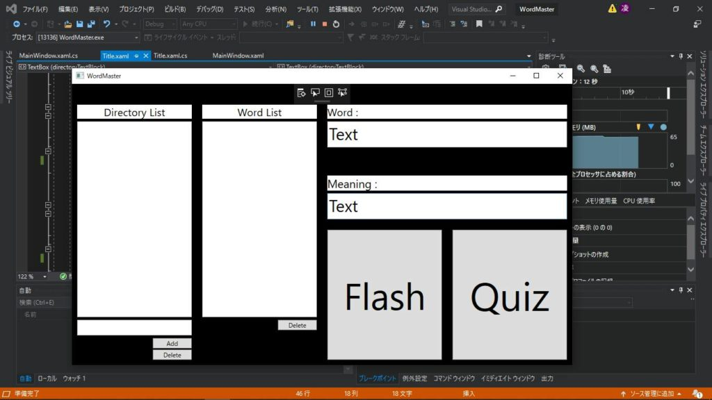
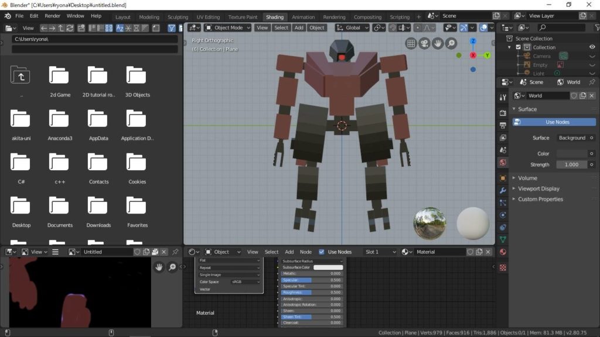
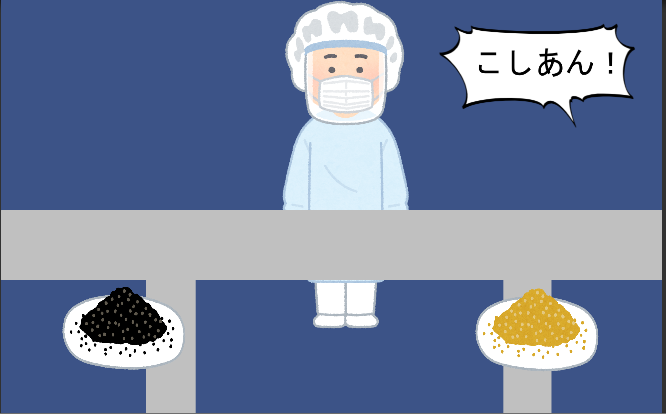
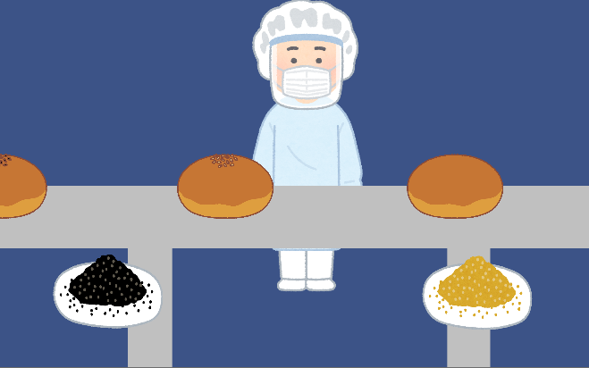

## はじめに

　こんにちは。3年次のまんじゅうです。オンライン授業の影響で課題が多くてヒィヒィ言ってます。初年次講義も始まって、本格的にサークル活動が始まったなとも思ってる今日この頃です

　先月に引き続き5月も報告会を行いました。ので、今回も記事を書いていきたいと思います(と言っても半月遅れな訳ですが‥)

　前置きはこのくらいにして、早速成果の紹介に移りましょうか

## 成果一覧

### 現役部門

#### 2年次

なりょー

　辞書機能を作ったようです。また、3Dモデル(骨格あり)を作ったりもしているようです

<figure>

<figcaption>

辞書機能。辞書に記録したり辞書の単語を検索したりできます

</figcaption>

</figure>

<figure>

<figcaption>

3Dモデル。関節があるので動きが滑らかです

</figcaption>

</figure>

ハイブリッジ

　競プロを引き続きやってるそうです。TechFul開催のハッカソンにも参加してみたようです

#### 3年次

kuroku

　あんパンを題材にしたゲームで、流れてくるあんぱんに対応したごまを乗せるゲームを作ったようです。

<figure>

<figcaption>

最初に流れてくる個数分の指示が出ます

</figcaption>

</figure>

<figure>

<figcaption>

指示の順番通りにごまを乗せていきます

</figcaption>

</figure>

ズッキー

　3Dテトリスの制作を進めているようです。2D版の回転処理は完成したそうなので、今後に期待ですね

<figure>

<figcaption>

最下層での回転処理もしっかり再現されています

</figcaption>

</figure>

TNPスタッフ

　BeatManiaやSoundVoltexみたいな、上から降ってくるタイプの音ゲーを制作していました。まだバグなどもあるようですが、しっかり作り込まれているように感じました

たか

　今後作るゲームの構想を語ってくれました。くにおくんみたいなゲームにするとの事なので、今後が楽しみです

コウ

　以前から制作しているシューティングゲームの、ハイスコアの記録を実装するのに苦戦しているようです

まんじゅう

　PAST(AtCoder社開催のプログラミング検定)を受験して、初級の判定を貰いました。あと競プロもやってますが、最近スランプ気味です

### 老害部門

#### 4年次

いっちー

　先月に引き続き、太鼓の達人風ゲームを作成しているようです。タイトル画面や選曲画面、プレイ画面などグラフィック面も作り込まれていて、とても完成度が高かったのが印象的です

## 最後に

　ここまで読んで頂きありがとうございました。この時期は学校の授業や初年次講義が始まる関係で忙しくなるので、報告が少なくなりがちです(この傾向を何とかしたい‥)。今年は皆課題も多いでしょうし、特にその傾向が強いように思えます

　来月以降はもうちょい報告増えると思うので、楽しみにしていて下さい(と圧力をかけてみる)

　それではまた来月。まんじゅうでした～
