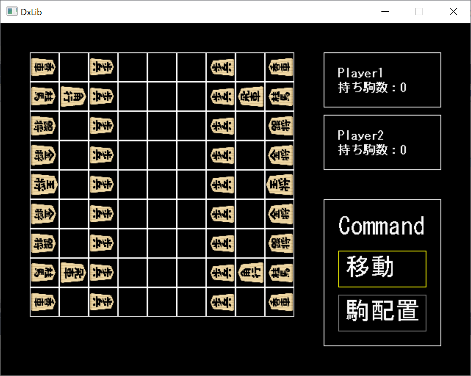

## はじめに

　こんにちは。3年次のまんじゅうです。こんな情勢ですが当サークルにも新入生がたくさん入り、嬉しい限りです

　さて、例のごとく6月も月末報告会を行ったのでその紹介をしていこうと思います。(また半月経ってるとか言わないで)

　それでは早速始めて行きます

## 成果紹介

#### 2年次

(先月に引き続き、2年次の皆さんに初年次講義を担当して貰っています)

なりょー

　armory3dという、絵とblenderのアドオンでゲームが作れる開発環境を触っていたようです

ドンキーコンゴ

　UnityのChronosという時間操作の機能を追加するアセットを使用して2Dゲームを制作しているようです

日傘

　自作ゲームのための立ち絵を制作したり、ゲームのプロットを考えていたようです

#### 3年次

ズッキー

　引き続き3Dテトリスを作成しているようです。2Dでの機能は概ね完成している様に感じました

たか

　くにお君風のゲームの制作に苦戦しているようです

コウ

　ファイル読み込みを実装出来たことで、ハイスコア機能を実装出来たようです

TNPスタッフ

　引き続き音ゲーを制作していたようです。大分完成まで近づいている印象でした

kuroku

　Unityを用いてサーバ・クライアントで動きを同期させる練習をしていたようです

こうぐち

　競プロに励んでいたようです

まんじゅう

　将棋作ってました。まだバグが少々残っているので潰していきたいです

<figure>

<figcaption>

至ってシンプルです

</figcaption>

</figure>

## 最後に

　いかがだったでしょうか。今月は内容が少なめですが、例年この時期は中間試験の関係で減りがちだったり。来月に期待ですね

　それではまた来月。まんじゅうでした
