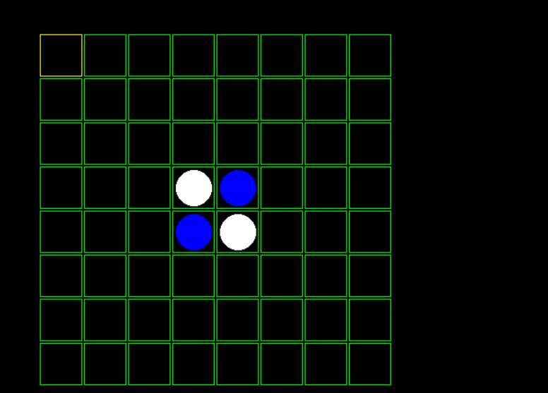
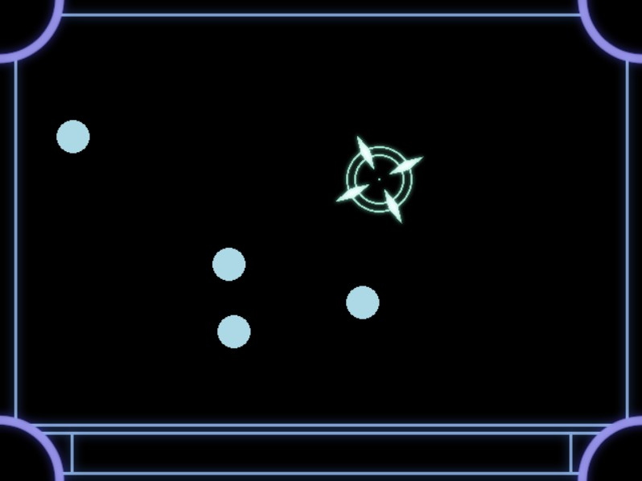
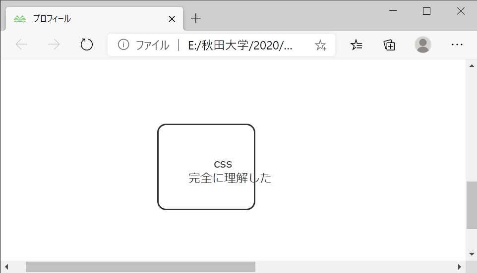
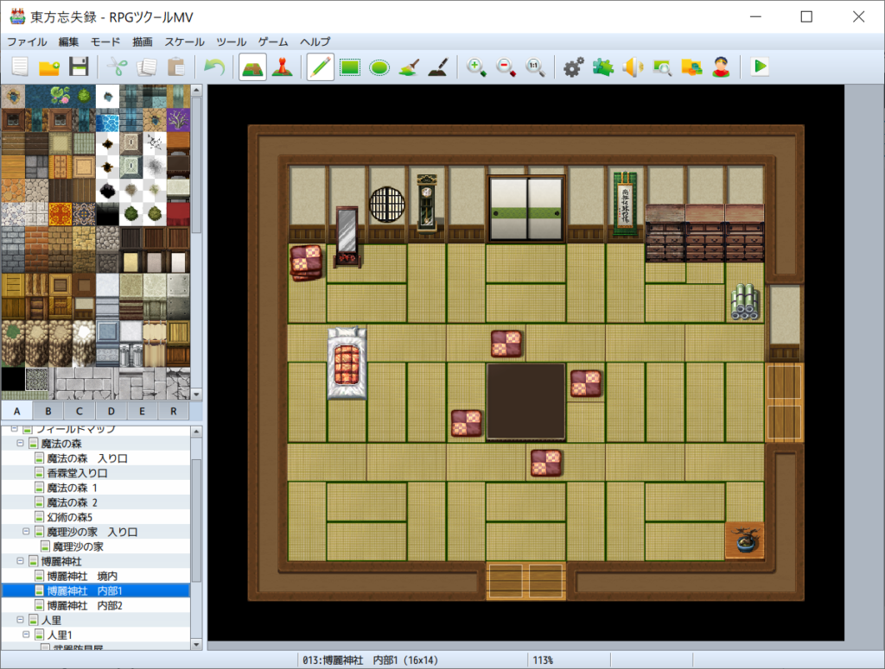

## はじめに

　こんにちは。3年次のまんじゅうです。暑くなってきましたね。オンラインでの活動だったので初年次講義が終わるかハラハラしてましたが、目処が立った(先発組は終了)ので一安心です

　さて、7月もいつも通り報告会を行ったので、毎度のごとく紹介をしていきたいと思います。それではどうぞ

## 成果紹介

#### 1年次

クロ

　DXライブラリでオセロ作ってました。まだ画面の表示だけ実装できたとの事だったので、今後に期待です

<figure>

<figcaption>

見た目はとてもしっくりきます

</figcaption>

</figure>

Amp.

　DXライブラリで射撃ゲームを作成していました。基本構造は出来ているとのことなので、今後どうなるかこちらも期待です

<figure>

<figcaption>

挙動はかなり仕上がっていました

</figcaption>

</figure>

#### 2年次

なりょー

　Unityでぷよぷよを作ってたようで、挙動もしっかりしてました。今後はUnityでRPGを作りたいとのこと

ドンキーコンゴ

　こちらもUnityでぷよぷよを作ったとの事です。動きとしてはなりょー君のと大差ない(元ネタがある以上仕方ない)そうですが、彼とは違うアプローチでアルゴリズムを組んでいました

日傘

　立ち絵、BGMを制作し、ゲームのプロットを引き続き作っていたようです。自前で素材作れるのは凄い(直球)

ハイブリッジ

　CSSを用いて簡単なWebページを作ったようです。また今後は格闘ゲームを制作したいとのことです

<figure>

<figcaption>

果たして、完全に理解出来ているのだろうか

</figcaption>

</figure>

#### 3年次

まんじゅう

　RPGツクールでマップ作ってました

<figure>

<figcaption>

マップを一から作るのは大変です

</figcaption>

</figure>

ズッキー

　3Dテトリスの構成を考えていたようです

コウ

　現在制作しているシューティングゲームで、今後実装したい機能について語ってくれました

クマ

　地道に競プロを頑張ってるようです

## 最後に

　ここまでお読み頂きありがとうございます。先に初年次講義を終えた2人も発表してくれましたが、初めての自力でのゲーム制作で、かつ制作に当てれた期間まで考慮すると相当頑張ってるなと感じました。僕も彼らを見習って来月はそこそこ成果語れるようにします(宣言)

　それと今月は珍しく同じゲームを作ってる2人がいました。(当たり前ですが)人によってプログラムの組み方は違ってくるので、そういう所を比べてみるのも面白いですよね

　というところで今回はここまで。また来月お会いしましょう。
