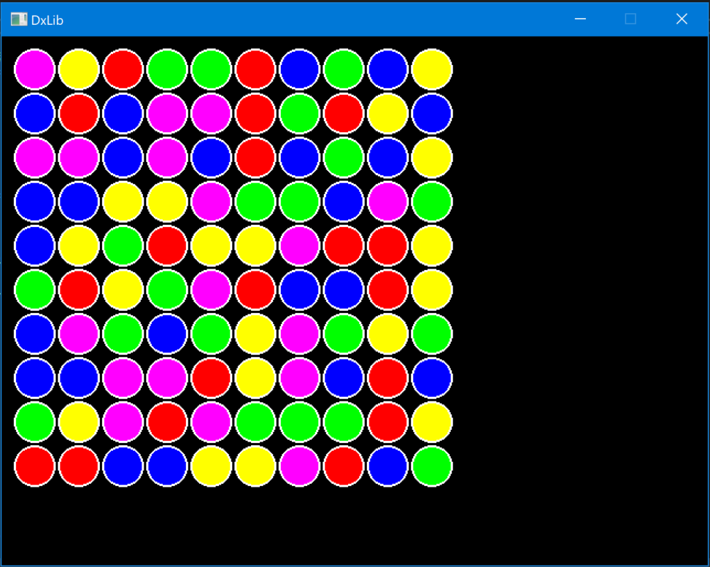
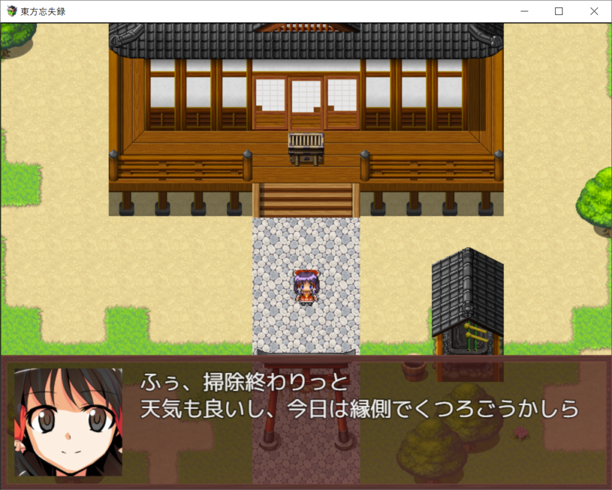

## はじめに

　こんにちは。3年次のまんじゅうです。後期開始から1週間が経ち、ようやく夏休みが終わった実感が出てきました。大学にも入れるようになったのでこの調子で良くなって欲しいところです(ところで部室は...)

　それと、3年次はあと1ヶ月で老害になってしまいます。時が経つのは早いですね

　今月も報告会を行ったので、その内容を書いていこうと思います。最後までお読み頂ければ幸いです

## 成果一覧

###### 1年次

Amp.

　スニーキングゲーム(敵から隠れながら進めるゲーム)を作っているようです。現在は見た目だけとの事

クロ

　ゲームジャムで2048を作ったとのことです。詳しくは[こちら](http://akitatnp.wp.xdomain.jp/2020/09/24/%e4%b9%85%e3%81%97%e3%81%b6%e3%82%8a%e3%81%ae%e3%82%b2%e3%83%bc%e3%83%a0%e3%82%b8%e3%83%a3%e3%83%a0/)をご覧下さい

###### 2年次

なりょー

　ゲームジャムで制作した作品を改良していたようです(詳しくは[こちら](http://akitatnp.wp.xdomain.jp/2020/09/24/%e4%b9%85%e3%81%97%e3%81%b6%e3%82%8a%e3%81%ae%e3%82%b2%e3%83%bc%e3%83%a0%e3%82%b8%e3%83%a3%e3%83%a0/))。今後はドンキーコンゴ君と何か作りたいとの事です

Kei

　落ち物パズルゲームを作っていたとのことです。クリックしたオブジェクトとその上下左右の同じ色のオブジェクトが消えるようになっており、処理部分はかなり作業が進んでいるように感じました

<figure>

<figcaption>

オブジェクトを消して空いたスペースには上からオブジェクトが降ってきます。自動生成も完璧でした

</figcaption>

</figure>

UMA

　3Dプリンターを使って物を作ったりしていたようです。プログラミングサークルとは()

日傘

　厚塗りを習得したそうです。間違いなく今年度で素材制作力が一番伸びていますね

###### 3年次

まんじゅう

　例のツクールゲーを作ってました。プロローグはバグ多めでしたが(現在は修正済み)、なんとか制作しきりました。今後も制作頑張ります

<figure>

<figcaption>

※画面は開発中のものです

</figcaption>

</figure>

ズッキー

　3Dテトリスを断念したそうです。今後はJavaとか競プロとか触りたいとの事です

TNPスタッフ

　音ゲーのバグ潰しをやってたようです。現在はキー対応で難航しているようです

クマ

　今月も競プロやってたそうです

## 最後に

　いかがだったでしょうか。毎回長期休みだとだらけて成果でない人などが出がちですが、今回の夏休みは例年より短いため作業に充てる時間を作れなかった人も居たみたいです。まあ今後頑張っていけば多分問題無いでしょう、きっと

　あと、制作に慣れていない1年次は分からない所を上級生に聞いたりしながら、少しずつ制作頑張ってみましょう

　それではここまで。お読み頂きありがとうございました。次回は私書いてるか分かりませんが(そもそも担当変わったら続くかも分かりませんが)、また次回お会いしましょう
