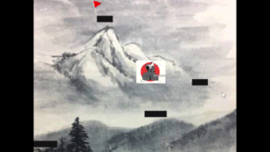
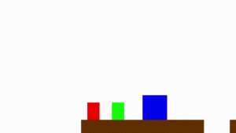
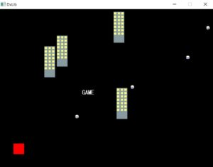
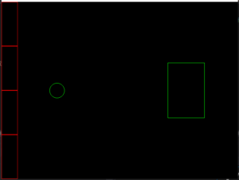

初めまして、3年次のNariaです。  
ブログ担当が長らく疾走20点OTKしたままなので、私が書くことにしました。

今回は、夏休みにやったゲームジャムについてです。  
このゲームジャムは1年次が主体で、2年次以上がスタンドになる形式で進めました。

お題は、運営、バレーボール、会社、掛け軸、直立不動で、環境はdxlib&c++です。

・Oくん

　タイトルはSAMURAI CLIMBER

　お侍さんが和風な世界を駆けあがっていく、和風テイストなゲームです。  
ゴール判定が未実装で、足場とジャンプの処理に課題が残った感じです。

　成長が楽しみです。

・レイルくん

　これは、会社に行きたくなくて直立不動になった人を、障害物を排除しながら会社に連れていくゲームです。

　赤がプレイヤー、緑が会社員、青が障害物で、会社員はジャンプできないので障害物で穴をふさいでゴールを目指します。

　改善点は障害物周りのバグの改善と障害物を破壊可能にすること、タイムの表示や画像の用意だそうです。オブジェクト指向をやってみないか？

・Nくん

　バレーボールで会社を倒すシューティングゲームで、最大6発まで連射可能です。個人的に1番好きなゲームです。

　次は龍神録だな（暗黒微笑）

・Tくん

　直立不動の人にバレーボールを当てるゲームです。左側がプレイヤーの操作エリアで、右の人に当てたボールがランダムに跳ね返ってきます。プレイヤーが打ち返した回数に応じてスコアが加算される予定です。

　コイツはワシが育てた。

　今回参加してくれたのは、多分この4人と後方腕組み勢達です。漏れがあったらすみません。ここまでお読みいただきありがとうございました。
