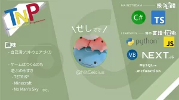
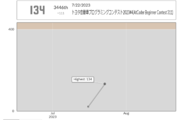
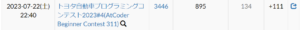
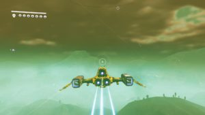
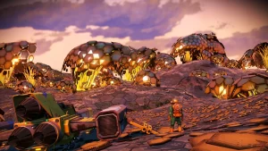

2022年入部、現在2年次の「せし」(℃)です。

## TL;DR

 / @NitCelcius  
 / C#もUnityもNext.jsもすき  
 / 初年次講義(新)の作成者  
 / 競プロもやってる  
 / 「ものづくりってたのしい」。

## \## @NitCelcius

TNPで記事を書くのははじめてなので、自己紹介をあげておきます:

## \## 3文+αで紹介する

- ソフトウェアを自己満でつくりながら勉強中
- ゲームはつくるのも遊ぶのもすき
- C# / TypeScript / Next.js 推し
    - ごりごり python / PHP / VB.NET を書いた苦い経験あり

です！

## \## ついでに

緑色がすき。とくに #B5CAA0 (裏柳色)

## \## TNP内での活動

これに加えて、TNPに入部したメンバーへプログラミングを教える(?)ために、あるいは知識を共有したりためこんだりするために、「初年次講義」を作っています。

一部のスライドはすでに公開しています。たとえばこんな感じ:

これは、[Office](https://office.com/webapps) の機能を利用した、[Microsoft Office](https://office.com) の埋め込み型のプレゼンテーションです。

(リンク) [OneDrive: 初年次講義(公開用)](https://1drv.ms/p/s!AkOcOaEJGKyQgY9nSKg66tlflh1egQ?e=IRcMab)

ゲーム作成はまだだけれど、Unityをやってます。

## \## TNP外での活動

\### 競プロ

競技プログラミングに興味があって、2週間前にはじめたらこうなりました:

 

このままいけば緑色に収束するみたいです。がんばります～～

### \### 英語

それなりにできるつもり....  
(ボランティアで、気に入ったアプリの翻訳とかやってたりします)

### \### ゲーム

Minecraft と No Man's Sky がすき。

### \### あとは

わりとガジェオタ気味。みどりのアイテムとわりと特殊な(?)パソコンが好みです

"ものづくりってたのしい。" をモットーというか原動力にがんばってます。

:よろしくね:
