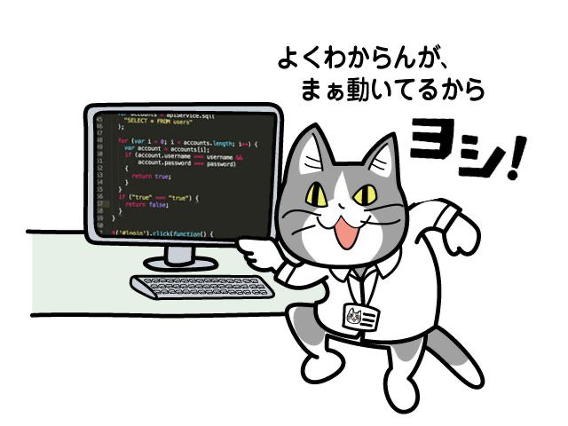

## はじめに

```
    お待たせ。待った？どうもプログラミングサークルTNP所属の広報担当kurokuです。（ｷﾂ...
```

先日サークル内で役職の引継ぎがあり、見事、広報担当（ブログ・Twitter更新）になってしまいましたなりました。

引継ぎの際に反省会も行われ、更新頻度について触れました。いい機会なので僕の目標というか、目安として（最低でも）月一回はブログを更新していきたいと思います。

 

そうはいうものの、毎月更新するとなると話題がなくなります。ただでさえ僕はグラブル、YouTubeでしか時間をつぶしていない気がするので、こんなことなら別に書かなくてもいいよなぁとか思うわけです。（むしろ書かない方がいい

そこで、サークル室のホワイトボードにブログの題材として質問などを受け付けようと考えました。誰でもいいのでゲーム制作でわからないことやプログラミングについてなどどんなことでもいいので書いてみてください。（コメント等でも歓迎です！

それについて僕が少し勉強して、このブログでできるだけ簡潔に、情報共有ができればなと思います。

（ただ、あまりにおじさんを悩ませるような難しい質問をすると僕の独断でなかったことにしてしまうかもしれません...）

 

  
  

## C++ってどうなの？

  

さて、いよいよ本題です！ホワイトボードに早速題材が書いてありました。

#### 「C++について」

 

いやいや。。

#### （雑じゃない？）

 

まぁいいんです。書きます。こんな感じでどんどん題材ください！

（できればもうちょい具体的に！

C++とは、手続型プログラミング言語であったC言語にオブジェクト指向やジェネリックプログラミングの考えを取り込んだ言語です。それぞれわかりやすく言うと、

・手続型

　プログラムを順番に実行していく

・オブジェクト指向

　オブジェクト（データと処理内容）ごとに独立させる考え

・ジェネリックプログラミング

　型などを意識させないように抽象化して記述する

といった感じ。

一見してC言語をもりもりにパワーアップさせたのがC++といった感がしますが、それは間違いありません。

しかし、そんなC++にも弱点はあります。

#### それは文法が難しいこと。

  （僕はC言語由来のプログラムしか書けないのでわかりませんが）多重継承というのを組み込んだせいでポリモーフィズムにも影響が出たりでなかったり（？）        

### よくわかんないですねーー。

      ですがサークル内でゲームを作る分には使えて損はないです。ライブラリもリファレンスも結構多めですし、何よりC言語が書ければC++も書ける！  
  
これで終わってもいいんですが、内容がなさすぎるのでどんなことができるのかについて軽く触れたいと思います。

#include<iostream>

#include<string>

int main(void) {

std::string s = "hello";

std::cout << s << std::endl;  //hello

       return 0;

}

C言語だとchar型の配列で書く必要があった文字列もC++ではstring型（正確にはstringクラス）に格納することができます。それに加え、文字列同士の足し算や部分文字列（例えば"ell"）を取り出したりなんかもできます。

std::cout<<s+s<<std::endl;  //hellohello

std::cout<<s.substr(1,3)<<std::endl;  //ell

  

#include<iostream>  
#include<vector>  
int main(void) {  
　　std::vector<int> vec;  
　　vec.push\_back(0);  
　　vec.push\_back(1);  
　　vec.push\_back(2);  
　　for (int i = 0; i < vec.size(); i++) {  
　　　　std::cout << vec\[i\] << std::endl;  //0,1,2  
　　}                   

      return 0;  
}

vector型（クラス）は配列とほとんど同じ挙動をします。ただ、宣言の部分で要素数を書いていないにもかかわらず値を格納することができています。

vectorは可変長配列と言われ、要素数を自由に変化させることができます。上の例だと宣言時は要素数は０でしたがpush\_back()するたびに自身で要素を増やし格納しています！（push\_backは末尾に格納するメソッド（関数））

さらにvectorはジェネリックプログラミングの要素も持っています。宣言する際にvector<int>としていますが、これはint型を要素に持つvectorを宣言しています。たとえばintの部分をdoubleやboolあるいは、自作の型MyDataとしてもvector<int>と同じく扱うことができます！

  

最後に紹介するのは演算子のオーバーロードです。

関数やデータ構造をユーザ側で定義できるのは知っていると思いますが、演算子についてもユーザが定義することができます！

例えば、

#include  
#include  
std::vector<int> operator\*(const std::vector<int>& vec, const int& t) {  
　　std::vector<int>v(vec.size());  
　　for (int i = 0; i < vec.size(); i++) {  
　　　　v\[i\] = vec\[i\] \* t;  
　　}  
　　return v;  
}  
int main(void) {  
　　std::vector<int> v = { 0, 1, 2, 3, 4 };  
　　v = v \* 5;  
　　for (int i = 0; i < v.size(); i++) {  
　　　　std::cout << v\[i\] << std::endl;　　//0,5,10,15,20  
　　}  
　　return 0;  
}

と書いてみます。本来vector<int>_intなんてできませんが自分で_を定義することでそれを実現できてしまいます！

しかし、演算子オーバーロードを闇雲に使うと演算子本来の挙動と整合性が取れなくなりとても危険です！詳しいことは各自で調べてもらうとして、できるだけあらかじめ実装されているものを使うようにしましょう。

  

## まとめ

  

大したこと書いてないのでまとめもくそもないんですが、まぁC++はいろいろ楽だよってことが伝わればいいかなと思います。興味が出てきた人はC++について調べたり、聞いたりして闇をのぞき込んでみればいいと思います。

こんな感じの雑まとめをこれからも月一以上で出していくのでどうぞお楽しみに！kurokuでした～。
