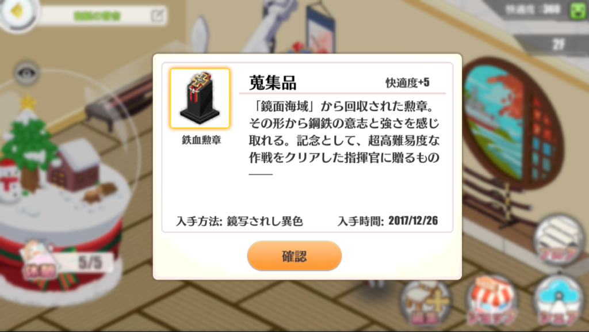
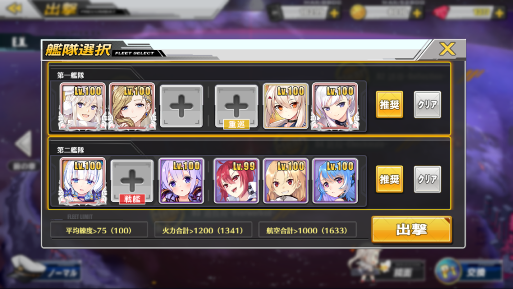
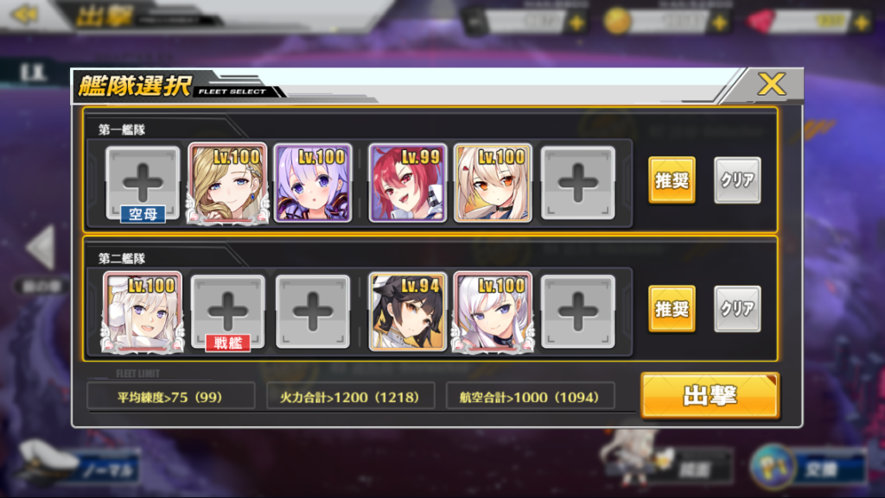

　どうも、和紙です。  
　26日中にアズールレーンの記事書くといいましたが、さすがに  
　20:00メンテ終わりからのD4クリア⇒記事書く  
　というムーブは難しかったですね…シノアリスもやってますし  
　まあ記事書くといったので書いていきますか！(書くほどでもないですが)

　えーっと、記事は間に合いませんでしたが、一応ちゃんと26日中にD4はクリアしました  
  
　入手時間：2017/12/26と刻まれております。これだけで一生ドヤれます多分。

  
　で、クリアした編成というか周回編成なんですが12/27 16:00時点ではこんな感じで周ってます。  
  
　エンプラフッドとベル綾波、ホルアクティ＆可能性の獣と三幻神 ですね。  
　うん、特に言うことはないです。  
　燃料、上が47で下が55です。  
　上5戦 下1戦でクリアできるので一周燃料322ですね。  
　レベル100がいればオートで難なく周れると思います。  
　クリアするだけならもっと人員割いていいんですが、それだと出撃できなくてですね…  
　多分綾波を高雄とか火力高いのに変えると三幻神一人抜いても良くなるはずです。  
　…以上です。

　はい。ほんとに話すことないぐらいぬるいんですよ。  
　なら鏡面海域の話は？ってことになるんですが、いまのところやるメリットが見つからないので手つけてないんですよね～。  
　どうせ海域周ってればポイント集まるしって感じで…  
　と、とりあえず現状はこんな編成で周ろうと思ってます。  
　もっとおすすめの編成があったらお教えください。  
　この後福袋買いに行きたいと思います。  
　では今回はこの辺で…。  
　皆様も良き指揮官ライフをお過ごしください…  
　私のこれが2017年最後というわけで、来年もプログラミングサークルTNPをよろしくお願いいたします。  
　良いお年を～ ﾉｼ

P.S.もちょっと燃費くなったので追記  
  
　上が燃料45、下が36  
　一周燃費225！安い！(当社比)
