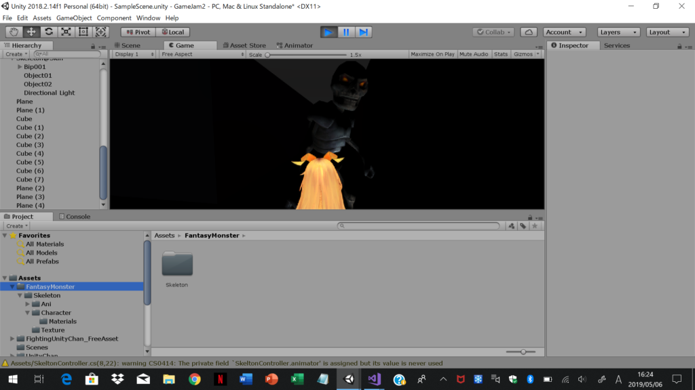
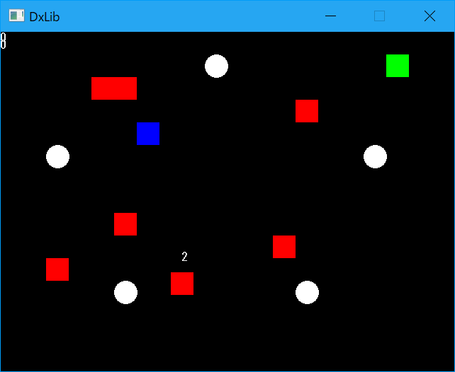
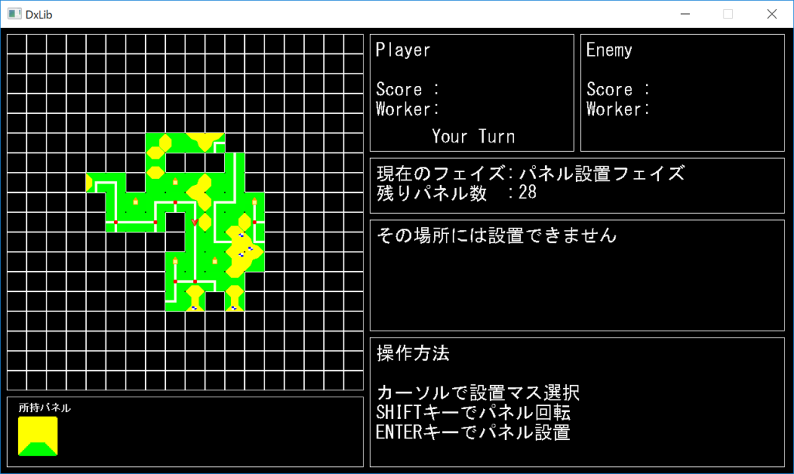
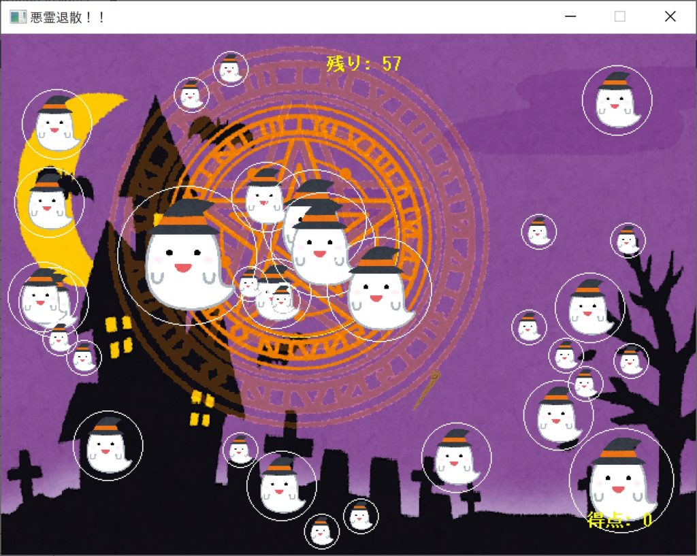

## はじめに

こんにちは、会長のいっちーです。

今年のGWは10連休ということで、4/30と5/1の2日間でゲームジャムを行いました。

今回のテーマは「**秒殺**」「**通り魔**」「**結ぶ**」「**昇天**」「**でくのぼう**」。

前回もそうでしたが、ゲームジャムのテーマとしてこの選択はどうなんでしょうね。

* * *

## 作品

### 2年次 ずっきー

開発環境「Unity」

「秒殺」をテーマとしたホラーゲームです。

女の子を操作して、迫りくる化け物から逃げようとしますが．．．。

とあるゲームを参考にしたようで、テーマの「秒殺」もそれに関連しているとか。

綺麗なグラフィックが臨場感溢れるホラーな雰囲気を醸し出しています。完成が楽しみですね。

* * *

### 2年次 でんそん

<figure>

<figcaption>

  

</figcaption>

</figure>

開発環境「ＤＸライブラリ」

「秒殺」「結ぶ」をテーマとした謎解きゲームです。

プレイヤーを操作して、マップに描かれている白いサークルを正しい順番で触れていくと次への道が開かれます。また、色付きのブロックには

- 緑ブロック：触れるとヒントが得られる
- 青ブロック：取ると復活時に"寿命"が延びる
- 赤ブロック：通り抜けられない壁

というように謎を解く上での重要な要素となっています。

なお、"寿命"とはこのゲームにおける制限時間のことで、プレイヤーの頭の上にあるカウントがそれを示しています。寿命は移動している間も減り続け、0になるとゲームオーバーとなります。

ゲームオーバー時にはその場で復活してやり直すことができますが、初期状態での寿命は"3秒"だそうで、まさに「秒殺」といえますね。

* * *

### 2年次 まんじゅう

開発環境「DXライブラリ」

「結ぶ」をテーマとしたボードゲームで、"カルカソンヌ"というゲームを参考にしたようです。

草原や道、城などが描かれたパネルを一枚絵になるように配置し、そこに人を置いていくことで得点が得られるようです。  

マップのスクロールやパネルを置く・回転させるといった、ゲームの基本要素を完成させました。

しかし、パネルや人の置き方にはかなりの自由度があるようで、本人曰く「大変なのはこれから」とのことでした。

* * *

### 3年次 いっちー

開発環境「DXライブラリ」

「昇天」をテーマとしたアクションゲームです。

幽霊を結界で囲み、結界を強化することで幽霊を昇天させることができます。また、幽霊は結界の境界線で反射するようにしました。

前回のゲームジャムでは時間内に完成できなかったため、今回はとにかく完成させることを目標に取り組んでみました。

素材は"いらすとや"でお借りしたのですが、統一感を出そうとした結果、ハロウィンテイストになりました。

* * *

## おわりに

ゲームジャムはいいものですね。

テーマと時間が縛られている分、普段よりも集中して取り組めたように思いますし、他の人のゲームのアイデアやその実装方法にはとても興味が引かれ、良い刺激になりました。

今回は3年次が私1人、2年次が途中参加を含めて5人とまだまだ参加率は低いですが、初参加の方もいたので、この調子でサークル内で少しずつ広まっていければなと思います。

また、今月からは本格的に初年次講義が始まります。今度は1年生も含めてペアプログラミングなんかもやってみたいですね。
