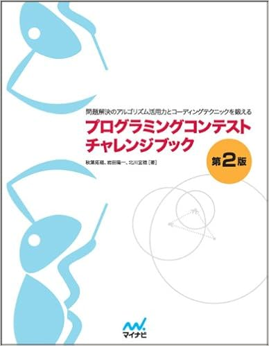

最近，大学で何を学んだんだろう，何をしてきたんだろう，といろいろ複雑なお気持ちな，四年生の老害，ガナリヤです

今回は，07/12(金)に開催されたICPCプログラミングコンテストのインターネット予選の参加記を適当ながら書いていこうと思います

おそらく，あとでYARUDAKEチームからも参加記が上がると思います（上がるよね（老害））

* * *

## 開始前

午前中，授業だったり研究のお話だったり色々と辛いお気持ちになっていました（かなしいね

かなしくなったので，14:30に会場である部屋に先入りしました（今回，監督員の先生には，この時間帯に部屋を予約してもらうなど，多くのご協力をいただきました．頭が上がりません．あとで感謝の品を持っていこうと思います．）

部屋に入る途中，後輩のkurokuくんに出会いました  
覚悟がちげえまろ

早く来すぎたかなと思いながら，持参したUSキーボードの準備やパソコンの立ち上げなどをしていました（大学のキーボードはJISなので）

その後，チームメンバーのsiiiecや三年生のいっちーなども来て，時間を無駄にしていました（集合早すぎた，ごめんなさい）

今回，Tech\_ONSは全員が四年生で研究室や，自分の場合入試勉強など非常に忙しく，国内模擬予選しか通し練習が出来ていませんでした．  
そのため，自作ライブラリはほとんど去年ので，おそらくバグだらけだったと思います（使わなかったので尚良）

今回持ってった本は

の三冊です（普通だな！）

あと，マスコットとして，ニコニコテレビちゃんと，プロ生ちゃんのアクリルスタンドを持っていきました，かわいいね（かわいいので

だらだらsiiiecと話していると，C\_avaも来て，打ち合わせをしながら時間を潰しました  
全員研究室が違うので，集まるのは大学でもそうそうないんですよね  
四年生って研究するけど，研究できなくないか？

そんなこんなしていると，16:30になり，ICPCが始まりました

* * *

## ICPCコンテスト

[問題リンク](https://storage.googleapis.com/icpcsec/2019-domestic/ja/contest/all_ja.html)

順[位表リンク](https://icpcsec.firebaseapp.com/)

今回のICPCは，去年と同じく最初の方針は同じで

- C\_avaがVisual StudioRTAをする
- siiiecがA問題を通す
- ganariyaがB問題を通す
- CはC\_avaのC
- Dを三人がかりでなんとかする

みたいな感じでした  
あと，誰かが解法を書いている間に，エッチなテストケースを書いて嘘を落とす，みたいな方針でした

プリンターの前でganariyaとsiiiecが待機して，C\_avaが印刷をしました

B問題を見ると，あ＾〜ってなる感じの問題でした  
簡単じゃ〜んって思いながら，平気でBFS書いていました（無駄）（戦犯）

コンテスト終了後，kuroku君の解法をきいて，マンハッタン距離でいいじゃんってなりました  
今回，自分のミスが響いて結構無駄な計算量を書けてしまいました  
次のAtCoderなどのコンテストからは，わかっても，一分追加で考察をしてからコーディングを行おうと思いました

B問題の嘘解法（重すぎ）が生えた時，siiiecがコーディングしてました，はやい

C\_avaのエッチなテストケースも通ったので，Aを通すと，そりゃもうAcceptでした，嬉しい

（A問題結局どういう問題だったんだろ）

その後，自分がB問題を解いて，当然遅い実行時間でしたが，Acceptはできました  
色々と反省が残るコンテストでした･･･

Bをお通ししたあとは，三人でCをいちゃこら考えていました

C問題は，$3^N$で全探索すればいいな〜ってなって，その後ganariyaとsiiiecで詰めながらコーディングしてました

いま思い返すと，このCも実装をミスっていて，実行時間が肥大化してました  
本当に思い返すとなんでそんなコード書いてるんだ？ってぐらいしょうもない実装を書いてて悲しくなりました，ほんとだめだめです

C問題を実行しながら，まあ答えが出れば通るやろ〜〜って，言いながらD問題に移りました

D問題は，カウンタをえいえいする問題で，なんかいやらしい問題だなってなりました（ぱっと見簡単だけど，多分むずい）

三人で考察してると，C問題の出力が出たので，投げるとWA（は？

とりあえず紙出力して，自分がCのデバッグ，  
siiiecとC\_avaでD問題の考察をしていました

Cは結局，分銅を追加しなくてもよい薬は先に取り出す，という操作でうまく行きました  
この処理は，最初に提出する前に一度書きかけて「いらないか！」となって消したのですごい悔しい  
すべてが裏目に出ている

Cはその後足りない処理を書き足したら，結局通り，再びD問題で停滞しました

三人で色々と考察を行い，C\_avaとsiiiecで実装を始め，サンプル地獄になっていました

その後も色々と考え，セグ木＋DP?って思いながら考察してたら非情にも時間になりました

Tech\_ONSは今年もまた，3完で幕を閉じたのです

* * *

## 振り返り+老害より

今年のICPCでは，Tech\_ONSは  
495チーム中，138位で終わりました

お気持ちとしては，悔しいというお気持ちと単純に力不足だったという感覚です

B, Cでガバ考察をしてしまったので，本当に申し訳ないし悔しいです

また，やはり三人がかりでも僕たちだとまだD問題は解けず，これが解けるようにならないと安定してアジアに行けないんだなと思いました（Dの解法は結局DPでした（DはDPのD））

嬉しい点としては，後輩チームが初参加で2完をしていて，頼もしいなと思いました  
TNPの競技プログラミングを始めた二年生も合計4人？（自分のおそらくの観測上）になり(最近かなりTNPから増えていて嬉しい)，秋田大学もどんどん競技プログラミングや，他のアプリ制作のコンテストに出て，どんどん秋大が強くなればいいなと思いました

このチームTech\_ONSで出場するのはおそらく今年で最後なので，アジアに行きたいなぁと思っていました

結果としては駄目でしたが，非常に貴重な経験が出来たので，競技プログラミングを初めて本当に良かったと思います

来年以降もTech\_ONSとして自分が出られるかは現状分かりませんが，来年以降も秋田大学で後輩チームがICPCに参加し，アジア大会への切符を掴んでほしいと思いました．

  
是非，このICPC・競技プログラミングの文化がTNPに続いて，来年以降の後輩チームが国内大会・アジア大会で活躍する姿を老害として見守りたいなと思います.

ガナリヤでした！

* * *

YARUDAKE編も見たいなぁ|・\`ω・)
