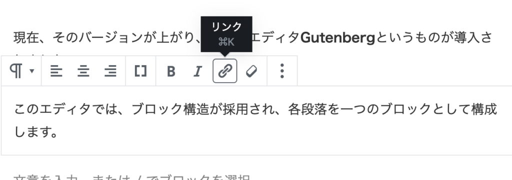
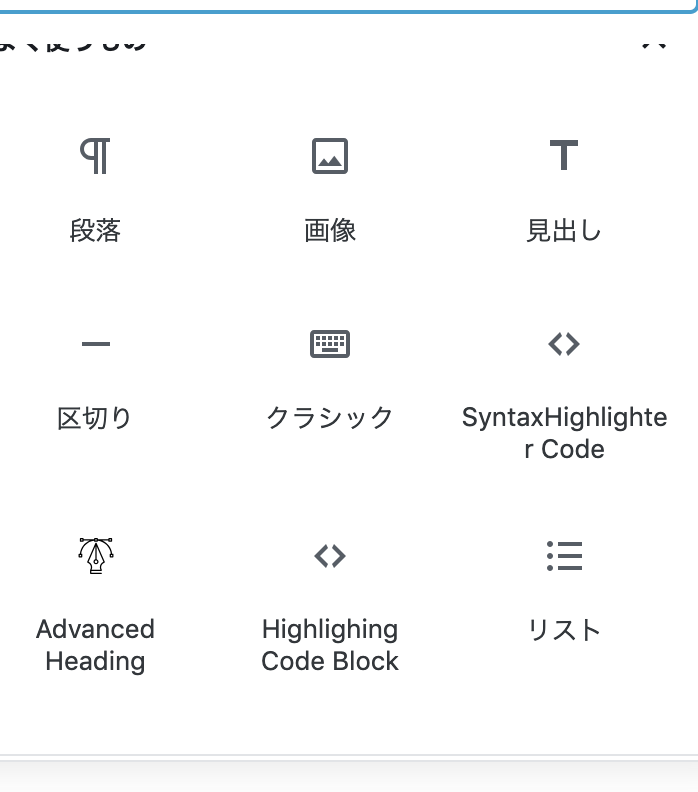

## こんにちえるえる〜〜

なんか久しぶりですね。

ガナリヤです。新しいバージョンにしたせいか、色々と不具合が起きて辛いです･･･なんとかします･･･

* * *

WordPressのバージョンが上がった話、使い方とLaTeXの話をします

* * *

## WordPressのバージョンが上がった話

WordPressというシステムを現在、TNPでは使っています。

WordPressはPHPで構成されているフレームワークであり、拡張しやすく、これまでブログよりも使いやすい点があります。  
また、WordPressに移行した理由として  

- 全員が使える。
- HTMLを知らなくても書ける（ビジュアルで書ける）

という点があります。  
  

現在、そのバージョンが上がり、新しいエディタ**Gutenberg**というものが導入されました。

このエディタでは、ブロック構造が採用され、各段落を一つのブロックとして構成します。

上記の段落は、以下の図のようなブロックとしてなっており、ブロックは自由に移動できます。

今回のエディタによって、よりノンプログラミングにブログをかけるようになりました。

ただ、これまでのブログのエディタに慣れていた人には辛いですが(現在辛いです･･･)

使ってみると分かると色々と分かると思います〜

* * *

## マークダウンを使うときは

プログラマーには、**マークダウン**というものに慣れている人がいます。  
僕もその一人です。  
マークダウンを使うとより高速にブログを書くことが出来ます。(ビジュアル操作を気にしなくていいと言うと伝わりやすいでしょうか･･･)

現在のエディタでマークダウンを書くには以下のようにしてください。

自分のパソコンの「Boostnote」などでマークダウンを書き、ブロックにコピペしてください。

すると、自動でマークダウンから、普段どおりの大きさやリスト、水平線に変換されます。

よって、現在は、このWordPressエディタ上でマークダウンはかけません。(一部はかけます。)  
これからWordPress上で書けるようにする方法はないか模索します。

* * *

## 改行の仕方

ブロックごとに書きますが普通に改行すると(エンターを押すと)

このように一行多く空きます。

なので、ブロックないで改行しようかな〜〜ていうときは「Shift + Enter」をしてください。  
すると、一行多く空けない通常の改行ができます。

* * *

## コード挿入の仕方

ソースコードを挿入したい時があると思います。  
そのようなときは以下のようにしてください。

「フォーマット」に入っている「Highilghing Code Block」というものを選び、ソースコードを挿入してください。

すると、ソースコードを挿入できます。

* * *

## LaTeXの使い方

プログラミングの記事を書くときは  
変数を$x$としたり、  
$$ y = 10x + 2$$

のように数式を使いたくなると思います。

これはLaTeXというもので実現できます。(TeXがもとであり、それを拡張したものがLaTeXだと思っていいかと思います。)

LaTeXを書くには半角の「ドルマーク $」でLaTeXしたいものを囲ってください。

つまり、　＄x＄と言った感じです。(これは、ドルマークを全角で表現しています。ここで半角にしてしまうと、LaTeXになって、どのようになるかが表現できないので･･･)

よって、LaTeXしたいときは、半角のドルマークで数式などを囲ってください。

また、中央に  
$$ y = x$$

のように表示したいときは半角のドルマークを  
＄＄ y = x ＄＄

のようにすると、中央寄せができます。

* * *

## 最後に

多分伝わらないと思います･･･(すいません）

今度部室で使い方をきちんと説明したいと思います。  
また、実際に触ってみると使い方がわかると思います。  
  
自分もまだこれに慣れてないので、大分読みづらいかと思います。すいません。

改善できるようにいろいろ工夫していこうと思います。

ガナリヤでした〜
