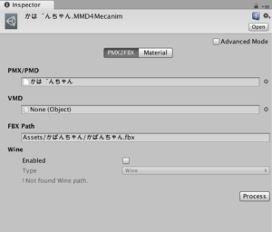
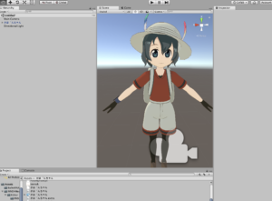

   
　お疲れ様です。ガナリヤです！  
　UnityでMMDモデルを使用したいと考えたのですが、なかなかうまく行かなかったため、忘れないうちにこちらに記しておこうと思います。  
  
  
  
UnityでMMDモデルを読み込む方法  
  
①Blenderで一度取り込み,.blendファイルを読み込む  
　MMDのモデルデータは、pmx形式になっています。  
　しかし、Unityで対応しているモデルデータ形式は  
　・fbxファイル(Unityではこれが普通。ただし、マテリアル、テクスチャが読み込まれないなどめんどくさい)  
　・blendファイル(Blender)  
　が主にあります。以前Splatoonプロジェクトを行ったときはfbx形式を使用していました。  
　今回は、BlenderでMMDモデルを取り込むため、fbx形式、blend形式のどちらでも良かったのですが、なぜかどちらもうまく行きませんでした。  
　fbx形式では、マテリアルとテクスチャが取り込まれず  
　blend形式では、マテリアルとテクスチャは取り込まれたものの、色の設定が行われておらず、表示位置から少しずれていました。  
　Unity2017の最新版で、うまく対応してないのかもしれません。  
　今回はこの方法でうまくいかないため、新たな方法②を使用しました。  
  
  
  
  
②MMD4Mecanimを使用する  
　MMD4MecanimはNoraさん([@**Stereoarts**](https://twitter.com/Stereoarts))が開発した、Unity上でMMDモデルであるpmx形式を直接読み込み、fbx形式に出力できるというすごいツールです！  
　  
　なお、MMD4Mecanimの導入は他のサイトさんをご利用ください。（うまくかけないため）  
  
　自分もMMD4Mecanimを導入したのですが  
　Processボタンを押してもうまく行きませんでした。  
　  
　そこで、うまくいかない理由は以下のとおりであると考えました。  
　「自分の開発環境がMacであり、MMD4MecanimはWindowsの機能を利用するため、うまくいかない」  
  
　そこで、上の画像にもあるのですが、「Wine」というLinux/Macで動作するアプリを使用しました。これは、Mac上で、Windowsのソフト、機能を使用することができるというアプリです。  
　このWineをインストールしてもうまく行きませんでした。（**後に確認したところ、Wineはなくても、最新のMMD4MecanimはMacでも動作するようです。**）　  
  
  
  
  
　_じゃあなんで行かないのじゃぁ・・・（のじゃロリ風）  
_  
　圧倒的壁に立ちはだかったため、開発者であるNoraさんに質問をさせていただきました。  
　質問をさせていただいたところ、UnityのEditorログにエラーが載っているとのことでした。  
  
　確認をしてみたところ  
「 Reason: Incompatible library version: pmx2fbx\_275 requires version 8.0.0 or later, but libiconv.2.dylib provides version 7.0.0  
Processed pmx2fbx.」  
　という表記があり、libiconv.2.dylibという動的ライブラリのバージョンが古いため作動していないということでした。  
  
　libiconvってなんやねんって思い、検索してみたところ、要約すると、文字列の文字コードを変換するライブラリでした。  
　・・・・・なるほど、よくわからん。  
　  
　とりあえずlibiconv.2.dylibのバージョンが8になればいいやと思い、色々とサイトを調べ、継ぎ接ぎ継ぎ接ぎ実行した結果うまく行きました。  
　方法としては  
**１．XCodeのコマンドラインツールが必要なため、インストール**  
**２．macportsというパッケージ管理ツールをダウンロードしてインストール（homebrewに近いものです）**  
**３．ターミナルに「port rev-upgrade」と入力し、libiconvをアップデート(うまくいかない場合は先頭に　sudo とつけて、管理者権限で行ってください)**  
**４．ターミナルに　「brew install libiconv」と入力し、libiconvをこれでもかとアップデート**  
  
　上の方法で、自分でもよくわかっていませんが、なんかうまくいきました。うまく行った結果は以下の画像です。  
  
　  
　かばんちゃんかわいいよハァハァ・・・  
  
  
　よくよく考えたら明日テストでした。  
　どうしましょう。以上、ガナリヤでした
