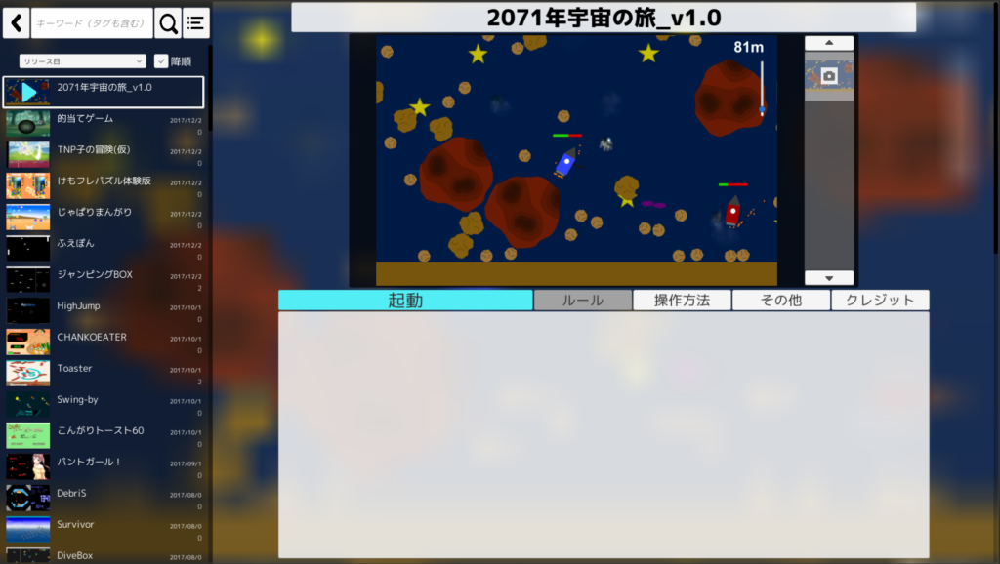

この記事は今後、大きく加筆・修正される予定です！！

（中の人は学祭当日未明、この記事を書いています…

 

「TNG」はTNPのゲームを一括管理・公開するために作られたランチャーのような何かです。同じ役割を担っていた、先代の「ゲームジェネレーター」の改良版として、一年前から制作されてきました。（ただし今もバグまみれの模様）

制作は私サバと、現会長のコショウ氏が主に行い、アイコンは蟹氏に描いていただきました。イメージは魚のタナゴだそうです。（TNG＋魚要素＝タナゴ）

ちなみにTNGは「Tnp's Next generation Game launcher」の略です。さらに展開すると、「The next generation programmer's Next generation Game launcher」という php のような再帰的頭字語みがある気がして気に入ってます。
