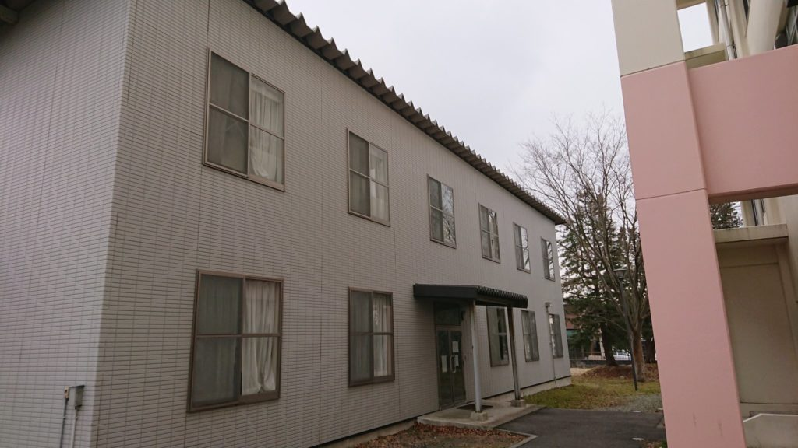

#### やっぱり気になると思う点

はいほー！どうもでったーです。

先輩(ガナリヤさん)がブログをじゃんじゃん書いてくれと大義名分っぽいことを宣言してくれたので元来書き物と自分語り(違う)を得意とする僕が今回も新入生ガイドライン的な感じで  
「TNPにはどんな先輩がいるんだろう・・」という疑問に勝手に答えていきたいと思います

#### 断言します。ここはオタクの止まり木です

「いやそんなこと言うなよ」って声を上げる部員もいるかもしれませんがこのサークルで交わされるプログラミング以外の会話の大半はオタクジャンルの話ですしネットスラングも多数飛び交います。(オタク以外来るなって意味では決してありません)

このサークルは創作活動だけでなくオタクという志を持った人たちと繋がる、という意味でも機能してるのかなぁという風に(少なくとも僕は)考えています。それを僕はタイトルにある「止まり木」という表現をするわけです。

#### どんなジャンルのオタクがいるか

TNP、正直多種多様なオタクがいます。一般的なオタクジャンルは大体履修してる人がいるはずです。(一般的の尺度が微妙なので確証は持てませんが)

今のところVtuber系に強い人が多少多めかなーって程度です。(ちなみに僕の履修ジャンルはアイマスなんでプログラミングやりたいプロデューサーがいたら是非来てほしいなぁと思っています。)

好きなゲームジャンルも色々です。上の年代は格ゲー中心ですが僕らの年代なんかはもうバラバラです。今流行りのゲームなんかの話題ならまあ結構通じると思います。

#### 活動時間中はどんな感じか

ここからは少し話の本筋からは外れますが活動時間中のサークルの雰囲気的なものを紹介します。(尺稼ぎともいいます)

活動時間中は基本的にみんな一つの部室の中で個々で創作活動をしているのでスタイルもかなりバラバラです。音楽を聴きながら、独り言を呟きながら、同じような言語で開発している人とアイディアなどを共有、アドバイスしあったり・・・かなり自由な空気なんで楽しく開発、創作をできるんじゃないかなーと思います。

活動の中で「月末報告会」というのがあるのでメンバーの活動を見て刺激を受けることができます。これは予想以上に制作のモチベーションに繋がります。アイディアも湧いてくるので面白いです。(まあこれは見てもらった方が早いんで説明しづらいのですが)  

#### まとめ

<figure>

<figcaption>

サークル棟はこんな感じ、大学敷地の端にあるので配布するチラシを頼りに来てほしいです

</figcaption>

</figure>

とりあえずプログラミングやコンテンツ制作に興味があるなら一度部室に足を運んでほしいなぁって切実に思ってます。経験未経験は全く問いませんしプログラミング以外でもゲーム音楽やイラスト製作をしたいと思っている人も大歓迎です(ぶっちゃけグラフィック系の人材が足りな過ぎてやばいです)

気になっている人はTwitter公式アカウント(@tnp\_ko)などに気軽に色々質問してみてください。このブログの過去記事なんかも参考になるかもです。

それでは皆さん、入学後の部活・サークル紹介で会いましょう！お待ちしています！  
サークル紹介での僕の目印は「EScape」(分かる人は分かるネタ)、でったーでした！
