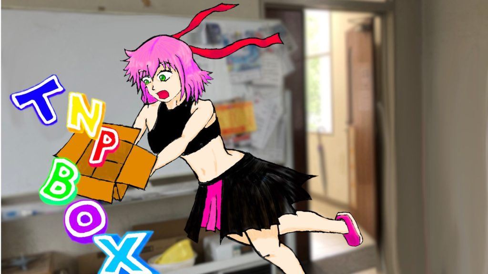
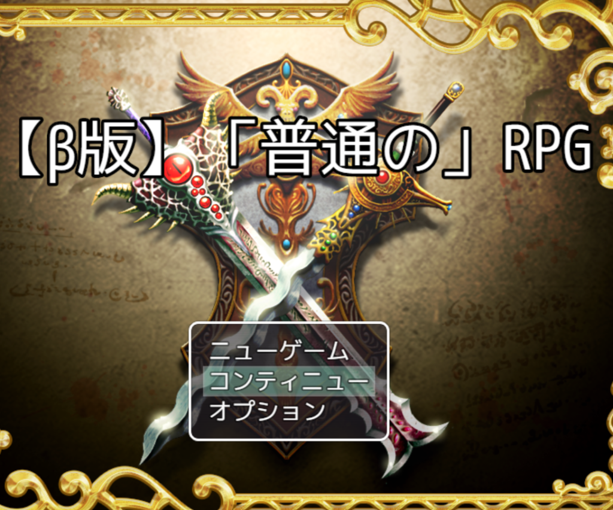
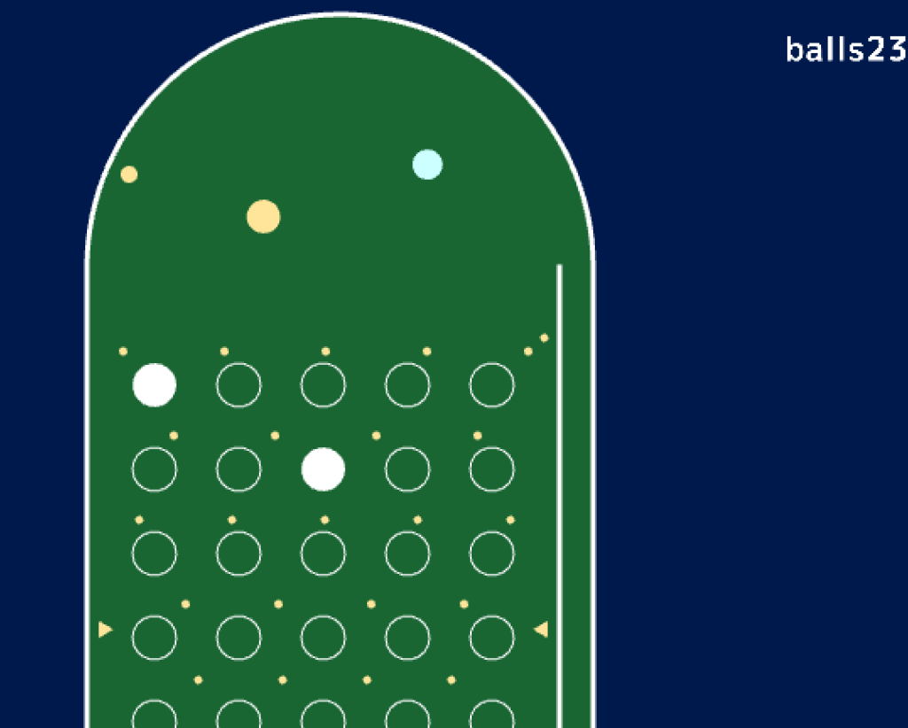
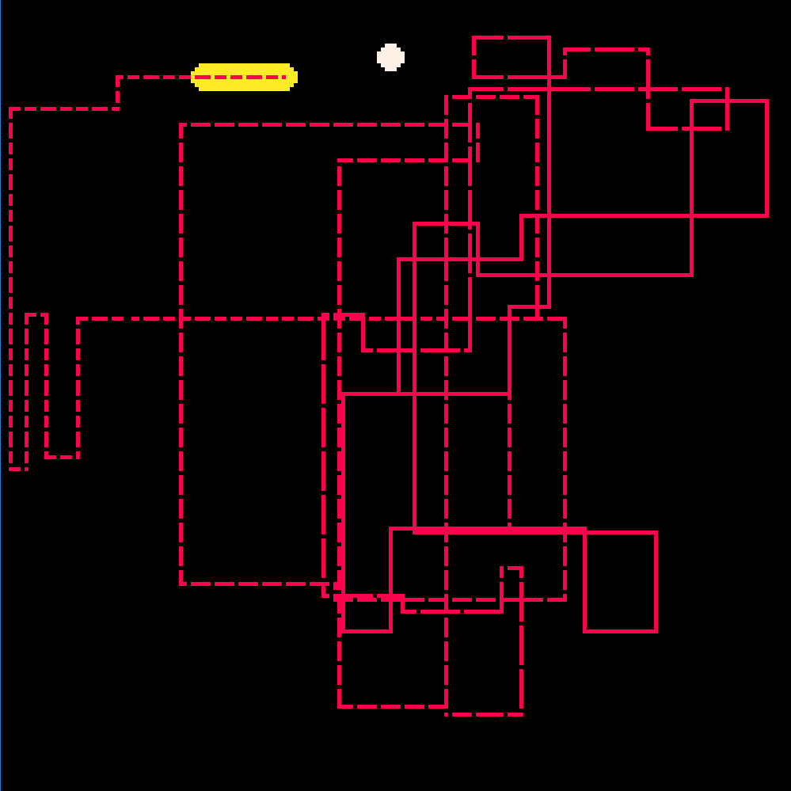
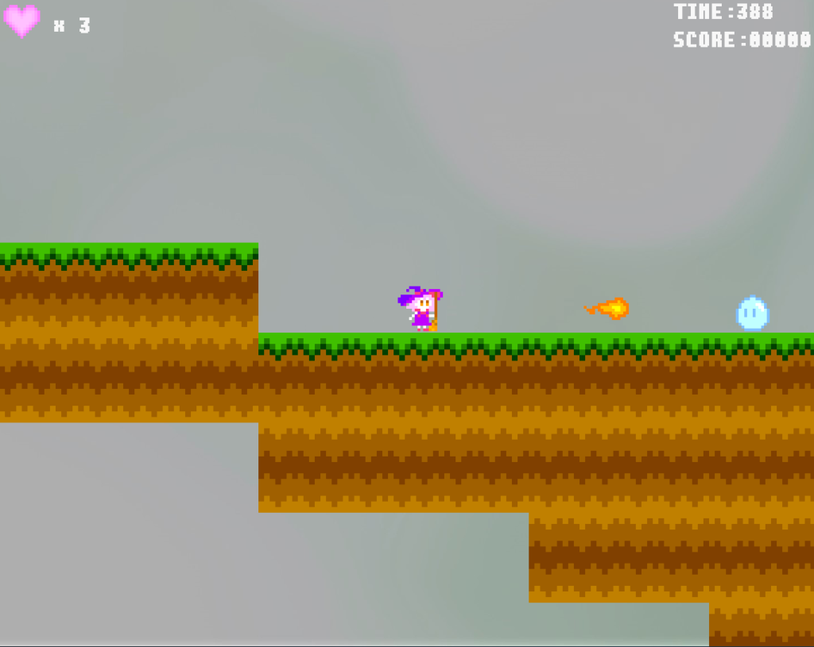
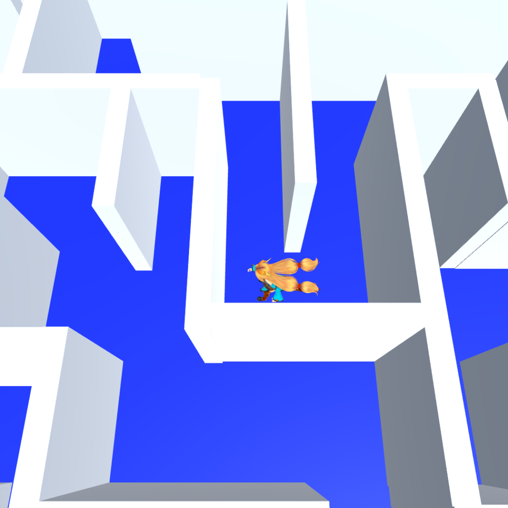
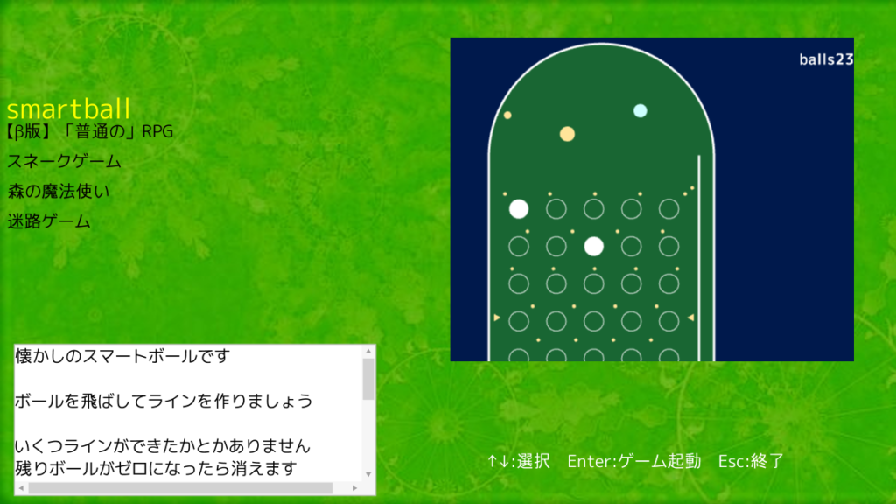

こんにちは。

TNP会長のいっちーです。

C96に出品する「**TNPBOX 2019 夏コミver.**」が完成いたしました。

内容は以下の通りになります。

- 【β版】「普通の」RPG
- smartball
- スネークゲーム
- 森の魔法使い
- 迷路ゲーム
- TNP BOX (ゲームランチャー)

* * *

## 表紙絵

制作者 : ハイブリッジ(1年次)

作品名の「TNPBOX」をイラストに落とし込み、当サークルのイメージキャラクター、TNP子とマッチさせた素晴らしい作品です。

絵が描けない2、3年次に代わり、 1年次のハイブリッジ君が描いてくれました。

* * *

## 【β版】「普通の」RPG

制作者 : まんじゅう(2年次)

開発環境 : RPGツクールMV

タイトルに「普通の」とある意味深なRPGゲームです。

今回はβ版ということで、完成版は"RPGアツマール"に投稿する予定だそうです。

※ゲームの途中で、**数秒毎にエラーメッセージが表示される**不具合が確認されています。その場合はお手数ですが、一度ゲームを**再起動**してくださいますようお願いいたします。

* * *

## smartball

制作者 : うおちー(3年次)

開発環境 : Siv3D

昔懐かしのスマートボールがパソコンで遊べます。

ボールの入る判定が絶妙で、ついつい熱中してしまうゲームです。

* * *

## スネークゲーム

制作者 : Yuta(3年次)

開発環境 : Pyxel

レトロな雰囲気が素敵なスネークゲームです。

ヘビの通った道が軌跡として残る、一風変わった仕様となっています。

* * *

## 森の魔法使い

製作者 : いっちー(3年次)

開発環境 : DXライブラリ

敵を倒し、アイテムを集めてゴールを目指すアクションゲームです。

動くブロックや消えるブロックなどの様々な仕掛けを用意し、遊び応えのあるゲームに仕上げました。

* * *

## 迷路ゲーム

製作者 : ズッキー(2年次)

開発環境 : Unity

ユニティちゃんを操作してゴールを目指す、3D迷路ゲームです。

滑らかなアニメーションと快適な操作性が、飽きを感じさせません。

俯瞰視点を切り換えられる親切設計です。

* * *

## TNP BOX (ゲームランチャー)

製作者 : でったー(2年次)

開発環境 : Siv3D

シンプルで洗練されたゲームランチャーです。

ゲーム起動時にはランチャーが自動的に隠れるようになっており、ゲームの邪魔にならないように工夫されています。

上記で紹介した5つのゲームをこれ一つで起動し、遊ぶことができます。

* * *

以上、6つの作品が入った「TNPBOX 2019 夏コミver.」を100円で頒布いたします。

「 **月曜日 南地区 "ユ" ブロック 36a** 」でお待ちしておりますので、ぜひお越しください！！
