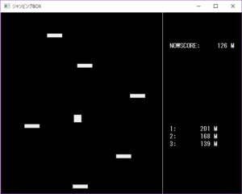

# TNPBOX2017ver.Winter

 どうもTNPの会計業務とコミケ遠征を生業にしているBヒロです。今回はTNPBOX2017ver.Winterの内容物に関するお話をさせていただきます。ではまず今回のゲーム本数はですね...なんと自分がコミケ担当初めて以来、最多の11本です。

　内訳

・秋大祭展示ゲームより、Swing-by(制作:サバ)、Toaster(制作:サバ)、こんがりトースト60(制作:こしょう)、パントガール!(制作:ガナリヤ)の4作品

    

・体験版(発展途上系ゲーム)、TNP子の冒険(仮)(制作:Ｂヒロ)、けもフレパズル(体験版)(制作:ガナリヤ)の２作品

 

・待望の新作ゲームより、じゃぱりまんがり(制作:Yuta)、ジャンピングBOX(制作:うおちー)、的当てゲーム(制作:いっちー)、2071宇宙の旅(制作:Golden River)、ふえぽんの五作品(制作:うおちー)

   

　

これらの11作品をぶち込んだTNPBOX2017ver.Winterは《C93・東第３ホール・ク-34b》で一部『100円』で頒布致します。この第ボリュームの《TNPBOX2017ver.Winter》をよろしくお願いいたします。当日は、わたくしBヒロとYuta氏とうおちー氏がお待ちしています。
